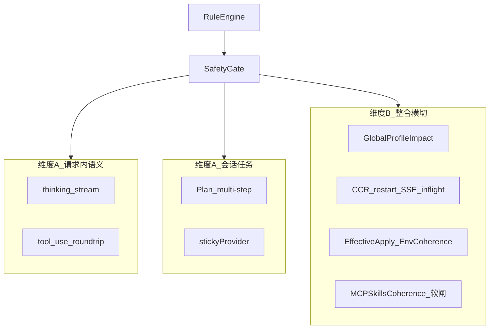
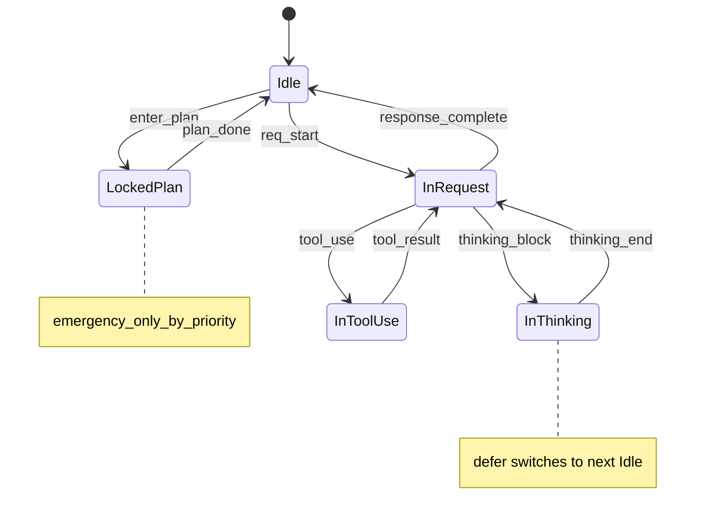
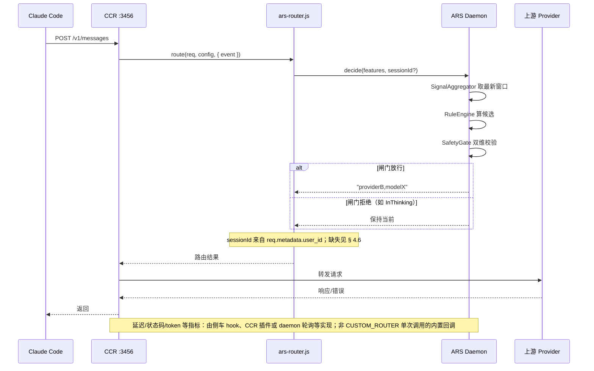
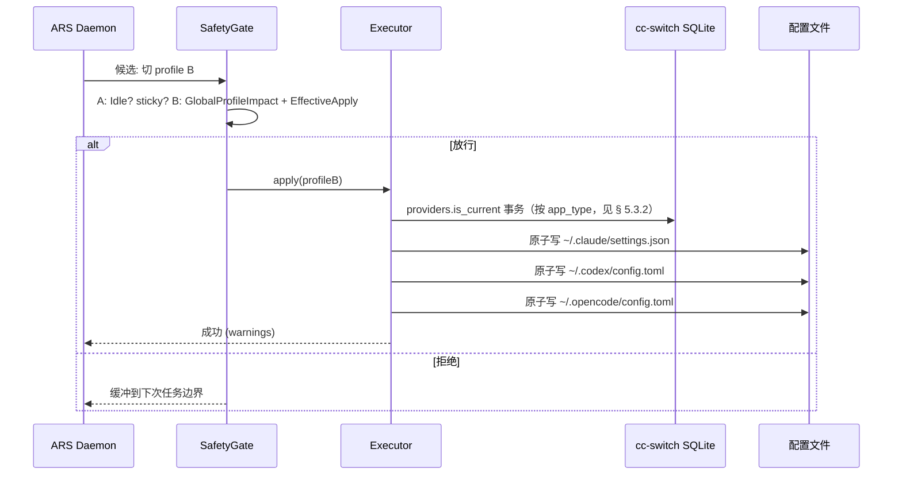
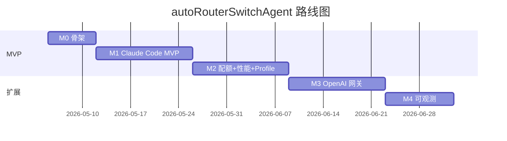

# autoRouterSwitchAgent 设计文档

> **版本**：v0.2（设计稿，已吸收评审修订）
> **最后更新**：2026-05-03
> **作者**：autoRouterSwitchAgent 设计协作组
> **目标读者**：实现者与维护者

本文为 autoRouterSwitchAgent（以下简称 **ARS**）的设计规格，基于以下材料综合得出：
- `reference/research/Claude 代码路由与切换工具对比.md`
- `reference/research/research_diff_by_doubao.md`
- 上游源码：`reference/claude-code-router/`、`reference/cc-switch/`
- 头脑风暴中已对齐的关键决策（见 § 1.3）

**上游参照**：实现时建议在仓库或 CI 中记录 `reference/claude-code-router` 与 `reference/cc-switch` 的 **git commit hash**，与本规格对照，避免上游演进导致路径/API 语义漂移。

---

## § 1 目标与非目标

### 1.1 一句话定义

ARS 是一个常驻 Node.js daemon，作为 Claude Code Router（CCR）的"决策大脑"和 cc-switch 的"自动化驱动手"。它根据多源运行时信号在合适的时机自动切换**请求级路由**（CCR）或**会话级 profile**（cc-switch），并通过严格的"切换闸门"避免在 thinking / Plan / tool_use 中途切换造成的会话漂移。

### 1.2 目标（Goals）

| # | 目标 |
|---|---|
| G1 | 在 Claude Code 上实现"信号驱动"的请求级 Provider/Model 自动切换，覆盖错误（429/5xx/超时）、配额（Token/QPS/月额度）、请求特征（长上下文/thinking/tool_use）、性能（延迟/失败率/质量）四类信号 |
| G2 | 在 Codex / OpenCode 上实现会话级 profile 自动切换（写 cc-switch SQLite + 多路径配置文件） |
| G3 | 通过 SafetyGate 双维结构保证多轮会话稳定性，避免 thinking 中、tool_use 中、Plan 期间被切换打断 |
| G4 | 决策机制以 YAML/JSON 规则链表达，可热改、可审计、可回放（`ars explain`） |
| G5 | 与 CCR / cc-switch 的对接基于其公共扩展点（`CUSTOM_ROUTER_PATH`、SQLite 表与配置文件原子写），不做侵入式 patch |
| G6 | 留出对 OpenAI 兼容协议（Codex / OpenCode）的请求级路由扩展位（M3 起内置 OpenAI 网关） |

### 1.3 非目标（Non-Goals）

- 不替代 CCR 的代理与 transformer 能力，也不替代 cc-switch 的 GUI 与多工具配置编辑器；
- 短期内不提供配置 GUI（仅 CLI + 文件）；
- 不做模型微调、prompt 改写、推理优化；
- 不做跨主机的分布式调度（ARS 是单机 daemon）；
- 不做计费/账单管理（仅做配额信号采集）。

### 1.4 已对齐的关键决策

| 维度 | 决策 |
|---|---|
| 核心定位 | 同时编排 CCR 与 cc-switch 的元 Agent |
| 触发信号 | 错误 + 配额 + 请求特征 + 性能（四类全要） |
| 部署形态 | 独立后台 daemon + CCR `CUSTOM_ROUTER_PATH` 接入点 |
| 编排策略 | 请求级走 CCR；会话级 profile 切换走 cc-switch |
| 决策机制 | 规则引擎 + 优先级链，YAML/JSON 热改 |
| 上下文保护 | SafetyGate 双维结构（A 对话相位 + B 整合横切） |
| 技术栈 | TypeScript / Node.js（与 CCR 同栈） |
| MVP 范围 | Claude Code 请求级 + Codex/OpenCode 会话级；M3 起内置 OpenAI 网关补全请求级 |

---

## § 2 术语

| 术语 | 含义 |
|---|---|
| **ARS** | autoRouterSwitchAgent，本设计的项目代号 |
| **Daemon** | ARS 的常驻进程，承载决策与执行核心 |
| **Shim** | `ars-router.js`，CCR 的 `CUSTOM_ROUTER_PATH` 入口脚本，本机 HTTP/IPC 调 daemon |
| **ProtocolGateway** | 请求拦截层抽象；图中与 CCR / M3 内置网关对应。M1 实际入口为 **CCR 进程 + `ars-router.js` shim**，daemon 不单独充当 Anthropic 监听端口 |
| **CCRChannel** | Executor 的请求级执行通道：热改 CCR config + restart |
| **ProfileChannel** | Executor 的会话级执行通道：写 cc-switch SQLite + 多路径配置文件 |
| **SafetyGate (A/B)** | 双维度切换闸门：A=对话相位，B=整合横切 |
| **sticky** | 多轮会话稳定锁，每个 sessionId 维护其 stickyProvider |
| **Idle / InRequest / InThinking / InToolUse / LockedPlan** | 对话相位状态机的状态 |
| **InRiskyPhase** | 无法可靠检测相位时的兜底状态 |
| **EmergencyPriority** | 配置阈值；在 SafetyGate 中作为**闸门例外**（见 § 5.2.1），非排序用的「万能优先级」 |

---

## § 3 顶层架构

### 3.1 架构图（图1 · 顶层架构）

```mermaid
flowchart LR
    subgraph 客户端
        CC[Claude Code]
        CX[Codex CLI]
        OC[OpenCode]
    end
    subgraph "ProtocolGateway 抽象层"
        AGW["Anthropic 网关 (CCR :3456)"]
        OGW["OpenAI 兼容网关 (ARS 内置 :3458, M3+)"]
        FUT["其他网关 预留"]
    end
    subgraph "ARS Daemon"
        SHIM_A[ars-router.js shim]
        SHIM_O[OpenAI proxy hooks]
        SIG[SignalAggregator]
        DEC[RuleEngine]
        GATE[SafetyGate 双维]
        EXEC[Executor]
        STORE[(StateStore SQLite)]
    end
    subgraph 执行通道
        CCRCH[CCRChannel]
        PROFCH[ProfileChannel]
    end
    CC -- ANTHROPIC_BASE_URL --> AGW
    CX -- "OPENAI_BASE_URL (M3+)" -.-> OGW
    OC -- "OPENAI_BASE_URL (M3+)" -.-> OGW
    CX -- "MVP: 仅 Profile" --> PROFCH
    OC -- "MVP: 仅 Profile" --> PROFCH
    AGW -.CUSTOM_ROUTER_PATH.-> SHIM_A
    OGW -.内置中间件.-> SHIM_O
    SHIM_A --> DEC
    SHIM_O --> DEC
    SIG --> DEC
    DEC --> GATE
    GATE --> EXEC
    EXEC --> CCRCH
    EXEC --> PROFCH
    DEC <--> STORE
    GATE <--> STORE
    AGW -.指标.-> SIG
```

### 3.2 组件清单

| 组件 | 角色与职责 |
|---|---|
| **ars-router.js (Shim)** | CCR 的 `CUSTOM_ROUTER_PATH` 入口。CCR 调用形态为 `customRouter(req, config, { event })`（见 `reference/claude-code-router/packages/core/src/utils/router.ts`）：`req` 为 Fastify 请求对象（已附 `tokenCount` 等）；`config` 为配置全集；第三参数为包含 **`event`** 的上下文（可用于未来订阅生命周期，见 § 4.6）。Shim 通过本机 HTTP/IPC 调 daemon，把每条 `/v1/messages` 的路由决策交给 ARS。返回值符合 CCR 约定（`"provider,model"` 字符串或 `null` 表示走默认路由链） |
| **SignalAggregator** | 汇集四类信号：① CCR shim 上报（错误码、延迟、token 数、tool 调用、thinking 标志）② Provider 配额（响应头 / 本地累计）③ 请求特征 ④ EWMA 性能滑窗 |
| **RuleEngine** | 解析 YAML/JSON 规则链，按优先级求值，输出候选切换动作 + 触发证据 |
| **SafetyGate** | 双维结构闸门（详 § 4） |
| **Executor** | 两通道实际执行：CCRChannel + ProfileChannel；负责备份、原子写、回滚、健康探测 |
| **StateStore** | SQLite，存：滚动窗口指标、sticky 表、冷却期、决策审计日志 |
| **CLI / 控制接口** | `ars start/stop/status/explain/reload`，预留本机 HTTP API（默认 127.0.0.1:3457）给未来 GUI |

### 3.3 协议覆盖矩阵

| 工具 | 协议 | 请求级路由（M1-M2） | 请求级路由（M3+） | 会话级切换（M2 起） | Profile 路径 |
|---|---|---|---|---|---|
| Claude Code | Anthropic `/v1/messages` | 支持（CCR + shim） | 不变 | 支持 | `~/.claude/settings.json` |
| Codex | OpenAI Chat Completions | 不支持 | 支持（内置 OpenAI 网关） | 支持 | `~/.codex/config.toml` |
| OpenCode | OpenAI 兼容 / 自定义 | 不支持 | 支持（内置 OpenAI 网关） | 支持 | `~/.opencode/config.toml` |

**说明**：CCR 仅拦截 Anthropic 协议，无法用于 Codex/OpenCode。M1-M2 阶段，Codex/OpenCode 的"切换"语义降级为 ProfileChannel（会话级，需重启终端）；M3 阶段 daemon 内置一个轻量 OpenAI 兼容反向代理（fastify，端口默认 3458），由 Codex/OpenCode 把 `OPENAI_BASE_URL` 指向它，复用同一套 `RuleEngine + SafetyGate + Executor`。M3 最小兼容子集与风险见 § 10.1。

### 3.4 M3 OpenAI 网关：兼容范围与风险（摘要）

详见 § 10.1。实施前勿将流式 tools / 全能力对齐与 M1 承诺混淆。

---

## § 4 SafetyGate 双维结构（设计核心）

### 4.1 双维总览（图2 · SafetyGate 双维）



SafetyGate 由两个**正交维度**组成，避免把"第四层聊天阶段"无限枚举化：

- **维度 A（对话相位）**：解决"同一条 SSE / tool 环 / Plan 任务内切换导致 Fragment / 漂移"的问题；
- **维度 B（整合横切）**：解决"全局 profile 冲击 / CCR 重启与在途流 / 配置生效与环境一致性"的问题。

### 4.2 维度 A · 对话相位状态机（图3 · 相位状态机）



**未知 / 不可解析相位**：当无法可靠检测 thinking / tool_use（例如 Codex / OpenCode 是子进程协议、或厂商流式格式差异），默认视为 **InRiskyPhase**——仅允许配置中定义的"紧急"优先级（`priority ≥ EmergencyPriority`）规则通过，其余 defer 至下一次 Idle。

### 4.3 维度 B · 整合横切策略表

| 闸门 id | 触发关注点 | 典型拦截 | 与 § 7 联动 |
|---|---|---|---|
| **GlobalProfileImpact** | `ccswitch.profile` 影响**整机/多工具**（SQLite + 多路径 TOML），与 per-session sticky 不同 | **quiesce**：ARS 判定「无任何 `sessionId` 处于 InRequest / InThinking / InToolUse / LockedPlan」（或 daemon 活跃会话集为空）后再写入；多 CLI 实例保守延迟。与 cc-switch **GUI 同时写库**的冲突与缓解见 § 7 | 审计、回滚 |
| **CCRrestartInflight** | `CCRChannel` 调用 `POST /api/restart` | **任意未结束 SSE / 重试队列未完成**时禁止调用 restart，排队至 Idle。参考实现中该接口会在短延迟后 **`process.exit(0)`**，即**终止整个 CCR 进程**（非进程内热重载），通常依赖外部守护进程拉起新实例；误触发会导致在途请求全部中断 | CCR restart 失败 → 回滚 + `ccr-down-fallback` 规则 |
| **EffectiveApply** | 部分切换需**新终端 / 环境变量**才生效（参见调研：Codex/OpenCode 切换需重启） | ProfileChannel：**延迟 apply**、写 `warnings`、可选"仅更新 cc-switch DB、提示用户重启"策略 | cc-switch 写入失败回滚 |
| **MCPSkillsCoherence**（软） | profile 切换若改变 MCP/Skills 集，与当前 CCR 会话假设不一致 | warn + 延迟至任务边界 | 不单独增加状态机状态 |

### 4.4 决策矩阵（相位 × 动作类型）

约定单元格语义：**允许** / **延迟至下一 Idle** / **仅紧急**（由 `priority ≥ EmergencyPriority` 定义，与 LockedPlan 一致）。

| 当前相位 \ 候选动作 | CCR 仅路由（无 restart） | CCR 热改 + restart | ProfileChannel（cc-switch + 多文件） |
|---|---|---|---|
| Idle | 允许 | 检查 **CCRrestartInflight** + cooldown | 检查 **GlobalProfileImpact** + **EffectiveApply** |
| InThinking / InToolUse | 延迟 | 延迟 | 延迟 |
| LockedPlan | 非紧急延迟 | 非紧急延迟 | 非紧急延迟 |
| sticky 窗口内 | 允许规则定义的"升级"阈值以上 | 延迟除非紧急 | 延迟除非紧急 |
| InRiskyPhase（未知） | 仅紧急 | 仅紧急 | 仅紧急 |

**实施约定**：路由 shim 路径以维度 A 为主；restart 与 profile 必须**同时**满足维度 B。Executor 在执行前查表 + 优先级判定，决策矩阵是**运行期硬约束**，不仅仅是文档注释。

### 4.5 多轮会话稳定锁（sticky）

- 每个 `sessionId` 维护 `stickyProvider`（默认 600s 内不主动切换）；
- **会话并发**：同一 `sessionId` 若出现并行 `/v1/messages`（少见但可能），维度 A 状态更新必须 **按 session 串行化**（互斥锁或单线程队列），避免相位与 sticky 竞态；
- 触发切换需满足：**错误等级 ≥ ERROR** 或 **规则优先级 ≥ EmergencyPriority**（后者仅在经过 SafetyGate 紧急例外语义判定后生效，见 § 5.2.1）；
- 切换写入审计日志，可通过 `ars explain <decisionId>` 回放；
- sticky 表存于 `StateStore`，进程重启后仍有效（基于 SQLite）。

### 4.6 维度 A：相位信号的权威来源与 MVP 边界

`CUSTOM_ROUTER_PATH` 在 CCR 中**仅于路由中间件内、对每个入站请求调用一次**（早于向上游转发）。因此：

- **响应流内**的 thinking 块、SSE 中途事件**不会自动进入** shim；仅靠默认 `ars-router.js` **无法完整驱动** § 4.2 中「InThinking ↔ …」的细粒度状态机。
- CCR 服务端存在 `event.emit('onSend', …)` 等钩子（见 `reference/claude-code-router/packages/server`），但**上游未约定**在加载 custom router 模块后对其注册长期 `event` 监听；要实现精确相位，需在下列路径中**显式择一**并在实现清单中落地：

| 方案 | 说明 | 与 G5（非侵入） |
|------|------|----------------|
| A. 保守降级 | 无法观测时视为 **InRiskyPhase**，仅 `priority ≥ EmergencyPriority` 通过 | 一致 |
| B. 请求内推断 | 仅从 `req.body.messages` 等推断 tool 轮询间隙等；**无法覆盖**响应中途 thinking | 一致 |
| C. 受控扩展 | 与上游约定可选入口（例如 router 模块导出 `init({ event })`）或**极薄 fork** 订阅 `onSend` / 响应管线 | 需单独评估 |
| D. 侧车观测 | 独立 tail 日志或前置代理观测 SSE（复杂、一致性与延迟风险） | 运维成本高 |

**MVP（M1）承诺边界建议**：明确保证 **Idle 边界上的路由切换**、**429/错误场景下的延迟切换（defer）**、**长上下文等基于入站请求特征的 routing**；**不宣称**在未接入方案 C/D 的情况下对「响应流中途 thinking」的**精确**拦截。E2E 验收（§ 9.3）中对 thinking 的断言依赖所选相位方案；若采用 A/B，应标注为**最佳努力**或改为「下一请求边界」验证。

**sessionId 与 sticky**：CCR 从 `req.body.metadata.user_id` 解析 `sessionId`（`_session_` 分段，见 `router.ts`）。若缺失，daemon 使用配置的 **fallback key**（例如 `anon:<connectionId>` 或单次请求桶），sticky 与相位状态仅在该桶内有效；规格实现须写明降级策略。

---

## § 5 信号、规则与执行

### 5.1 SignalAggregator 信号源

| 类别 | 来源 | 示例字段 |
|---|---|---|
| **错误** | CCR shim 上报 / 网关日志 | `error.code`、`error.status`、`provider.failures5m` |
| **配额** | 上游响应头 / 本地累计 | `quota.month_used_pct`、`quota.qps_used`、`quota.token_budget_remaining` |
| **请求特征** | shim req hook | `request.tokenCount`、`request.has_tools`、`request.has_thinking`、`request.has_web_search` |
| **性能** | EWMA 滑动窗口 | `perf.p95_ms`、`perf.failure_rate_5m`、`perf.quality_score`（启发式：长度异常/工具调用失败率） |

### 5.2 规则示例（YAML，可热改）

```yaml
# 越大优先级越高；EmergencyPriority 默认 200
rules:
  - name: thinking-in-progress
    when: { phase: "InThinking|InToolUse" }
    action: { defer_until: "Idle" }
    priority: 999       # 文档性高优先级；实际 defer 由 SafetyGate 硬约束保证（见 § 5.2.1），不与 EmergencyPriority 混用

  - name: ccr-down-fallback
    when: { ccr.health: "down" }
    action: { ccswitch.profile: "official-direct" }
    priority: 200       # 紧急：CCR 不可用时切到直连 profile

  - name: long-context-route
    when: { request.tokenCount: ">60000" }
    action: { ccr.route: longContext }
    priority: 100

  - name: 429-soft-fallback
    when: { error.status: 429, provider.failures5m: ">=2" }
    action: { ccr.swap_provider: { from: "$current", to: "$next_in_chain" } }
    priority: 90
    cooldown: 120s

  - name: monthly-quota-near-limit
    when: { quota.month_used_pct: ">85" }
    action: { ccr.swap_provider: { to: "deepseek,deepseek-v3" } }
    priority: 80

  - name: latency-degraded
    when: { perf.p95_ms: ">8000", perf.window: "5m" }
    action: { ccr.swap_model: { to: "$cheap_fast" } }
    priority: 50

  - name: thinking-route
    when: { request.has_thinking: true }
    action: { ccr.route: think }
    priority: 40
```

**说明**：
- 规则解析与求值由 `RuleEngine` 完成，使用 `zod` 做启动期 schema 校验；
- `defer_until: Idle` 是 SafetyGate 的显式表达，使 `ars explain` 能回放"为何被延迟"；
- `cooldown` 防止同一规则在短时间内反复触发；
- `$current`、`$next_in_chain`、`$cheap_fast` 为变量占位，由 daemon 配置中的 `provider_chains` 解析。

### 5.2.1 RuleEngine 与 SafetyGate 求值顺序

单次决策的**唯一流水线**如下（不可颠倒）：

1. **SignalAggregator** 产出当前上下文信号（含相位、sticky、窗口指标等）。
2. **RuleEngine** 按 `priority` **从高到低**匹配规则，得到**最多一条**「获胜」规则及其 **action**（或「无匹配」）；同级优先级由配置内声明顺序或规则名打破平局（实现须固定策略并写入测试）。
3. **SafetyGate** 对该 action 做 **硬约束裁剪**（维度 A + 维度 B）：
   - 默认：相位 / `CCRrestartInflight` / `GlobalProfileImpact` 等不满足则 **拒绝执行**，记为 defer（或 noop）。
   - **例外**：当动作带「紧急」语义且 **`priority ≥ EmergencyPriority`** 时，允许按 § 4.4 矩阵放行 **仅紧急** 类单元格（含 LockedPlan、InRiskyPhase 等行的「仅紧急」列）。  
   - **`priority` 不超越矩阵**：未标记为紧急意图的动作，即使 priority 很高也不得在 InThinking 等相位强行切换；`thinking-in-progress` 一类规则的「999」仅用于匹配排序与审计可读性，**不是**越过 SafetyGate 的令牌。
4. **Sticky / cooldown**：在 Gate 允许执行之后才校验；紧急例外是否绕过 sticky 由配置 `EmergencyPriority` 与规则语义共同定义（仅紧急类动作）。

`ars explain` 应能输出：匹配的规则 id、Gate 判定结果、是否因 sticky/cooldown 二次否决。

### 5.3 Executor 通道

#### 5.3.1 CCRChannel（请求级）

执行流程：

1. 备份 `~/.claude-code-router/config.json` 至 `~/.ars/backups/ccr-<ts>.json`
2. 改写 Router / fallback / Providers 字段（仅最小变更集）
3. 临时文件 + 原子重命名（防破坏）
4. `POST {ccr_base}/api/restart`（参考实现见 `reference/claude-code-router/packages/server/src/index.ts`：短延迟后 **`process.exit(0)`**，依赖守护进程重启 CCR）
5. 健康探测：轮询 **`GET {ccr_base}/health`**（CCR 常见为根路径 `/health`，**非** `/api/health`；以实际部署版本为准，须在配置中可覆盖），超时建议可配置（默认 5s），确认**新进程**已监听
6. 任一步失败 → 回滚备份 + 触发 `ccr-down-fallback` 规则

参考：`reference/claude-code-router/packages/core/src/utils/router.ts`；`/health` 注册见 `packages/core/src/api/routes.ts`；`/api/restart` 见 `packages/server/src/index.ts`。

#### 5.3.2 ProfileChannel（会话级）

执行流程（事务式，任一失败回滚全部）：

1. 备份目标 profile 影响的所有文件
2. 更新 cc-switch SQLite，语义对齐 **`providers` 表 + `is_current`**（按 `app_type` 将同类型全置 `0` 再置目标 id 为 `1`），与 `reference/cc-switch/src-tauri/src/database/dao/providers.rs::set_current_provider` 一致；**禁止**臆造 `UPDATE provider SET active=…` 等**不存在**的列。OMO 多类别等边界见同文件 `set_omo_provider_current`
3. 原子写 Live 配置文件（参见 `live.rs`）：
   - `~/.claude/settings.json`（去除 cc-switch 内部字段，如 `api_format`）
   - `~/.codex/config.toml`
   - `~/.opencode/config.toml`
4. 通用配置片段合并（MCP / Prompts / 环境变量），参考 cc-switch 的 `write_live_with_common_config`
5. 写 `warnings`（如某些工具需重启终端才生效，由 EffectiveApply 闸门决定）

业务逻辑参照 `reference/cc-switch/src-tauri/src/services/provider/mod.rs`（`switch_provider` 等），实现层宜复用等价事务顺序而非手写孤立 SQL。

## § 6 关键时序

### 6.1 请求级自动切换（thinking 中保护，图4 · 请求级时序）



### 6.2 会话级 profile 切换（仅在 CCR 不可用 / 切账号 / 重大降级，图5 · 会话级时序）



---

## § 7 错误处理与降级

| 场景 | 行为 |
|---|---|
| Daemon 崩溃 | shim 退化为 CCR 默认路由（`return null`），不影响业务；systemd / launchd / PM2 拉起 |
| Daemon 不可达（HTTP 超时） | shim 5ms 超时即降级，不阻塞请求 |
| CCR restart 失败 | 回滚 `config.json` 备份；触发 `ccr-down-fallback` 切到直连 profile |
| cc-switch / GUI 与 ARS 同写 | ProfileChannel 写入前检测或锁；用户应避免 ARS 自动化与 GUI 同时切换同一 profile；备份与 WAL 模式降低损坏风险；调研中安全议题（如历史 CVE）须在部署面复查 |
| cc-switch 写入失败 | tx 回滚所有文件；下次任务边界重试；记录到审计 |
| 上游全部 429 | 进入冻结期（默认 5 分钟），仅放行 `long-context-route` 等豁免规则 |
| 规则配置错误 | 启动期 zod 校验失败 → 拒绝启动；运行期热加载失败 → 保留旧版 + 告警 |
| SQLite 损坏 | 启动期检测，备份后重建 schema，sticky/审计丢失但不影响功能 |
| 日志 | pino JSON 日志（`~/.ars/logs/`）+ SQLite 审计表；`ars status` 看实时、`ars explain <decisionId>` 看历史决策回放 |

---

## § 8 配置与目录约定

```
~/.ars/
├── config.yaml           # daemon 主配置（端口、规则文件指针、阈值、provider_chains）
├── rules.yaml            # 规则链
├── state.db              # SQLite：metrics / sticky / audit
├── logs/                 # pino 滚动日志
└── backups/              # CCR config.json / profile 文件备份
```

**集成点**：
- CCR 的 `~/.claude-code-router/config.json` 设置：
  ```json
  {
    "CUSTOM_ROUTER_PATH": "<install>/dist/ars-router.js"
  }
  ```
- M3 起，Codex / OpenCode 的 profile 在切换到"ARS 接管"时，会把 `OPENAI_BASE_URL` 指向 `http://127.0.0.1:3458`。

**主配置示例**：
```yaml
# ~/.ars/config.yaml
daemon:
  http_port: 3457
  ccr_url: http://127.0.0.1:3456
  ccr_health_path: /health    # 须与真实 CCR 一致；常见为 /health 而非 /api/health
  log_level: info

safety_gate:
  emergency_priority: 200
  sticky_ttl_seconds: 600
  freeze_period_seconds: 300

provider_chains:
  default: ["anthropic-official", "openrouter-claude", "deepseek"]
  cheap_fast: ["deepseek,deepseek-v3", "siliconflow,qwen-coder"]
  long_context: ["gemini,gemini-1.5-pro", "anthropic-official"]

rules_file: ~/.ars/rules.yaml
```

---

## § 9 测试策略

### 9.1 单元测试

- **RuleEngine**：规则匹配、优先级排序、冷却期、变量解析、zod schema 校验失败路径；
- **SafetyGate**：维度 A 状态机的全部转换路径、维度 B 闸门表的命中/拦截、决策矩阵的所有单元格、未知相位 `InRiskyPhase` 兜底；
- **Executor**：CCRChannel 备份-原子写-restart-回滚链路；ProfileChannel 多文件事务回滚；通用配置片段合并。

### 9.2 集成测试

- 启动 mock CCR + mock provider；
- 注入信号场景：429 连击 / 超时 / 长上下文 / thinking 中断点 / Plan 模式 / cc-switch 切换 + 立即另一规则触发；
- 断言：daemon 决策路径、最终 `~/.claude-code-router/config.json` 内容、`~/.claude/settings.json` 内容、SQLite `audit` 表。

### 9.3 E2E 冒烟

- 真实 CCR + 真实 Claude Code；
- 准备一个 70k tokens 的 prompt → 触发 `long-context-route` → 看到模型切换到长上下文模型并完成响应；
- 断点测：在响应进行中（thinking 块）人为注入 429，验证当次响应**不**被切换打断；当次响应结束后下一次请求按规则切换。

### 9.4 回归红线

| 用例 | 期望 |
|---|---|
| thinking_block 中触发 429 | **不切**，下一次请求边界再切 |
| tool_use → tool_result 之间触发长上下文规则 | **不切** |
| LockedPlan 中触发非紧急规则 | **不切** |
| LockedPlan 中触发 priority ≥ EmergencyPriority 规则 | **切** |
| 未知相位下触发普通规则（priority < EmergencyPriority） | **不切** |
| sticky 窗口内同 provider 的 ERROR 重试 | **保持 sticky** 直到错误升级或冷却结束 |

---

## § 10 路线图

| 阶段 | 内容 |
|---|---|
| **M0 骨架** | 工程脚手架（pnpm + tsc）、CLI（commander）、SQLite schema（drizzle 或 better-sqlite3）、shim 加载到 CCR、空规则跑通 |
| **M1 Claude Code MVP** | 错误 / 长上下文 / thinking-in-progress 三类规则；CCRChannel；E2E 验证 |
| **M2 配额 + 性能 + Profile** | EWMA 性能滑窗；月配额跟踪；ProfileChannel 上线（Codex / OpenCode 会话级） |
| **M3 内置 OpenAI 网关** | fastify 起 :3458；`OPENAI_BASE_URL` 接管 Codex / OpenCode；请求级路由对齐 Claude Code |
| **M4 可观测** | `ars explain` 回放；审计页面；（可选）轻量 web 状态页 — **路由日志 Web UI 字段级规格见** [`spec/003-log-visualization-spec.md`](./003-log-visualization-spec.md)（默认只读 REST + 静态页，`127.0.0.1:3457`，与审计表同源）。 |

### 10.1 M3 内置 OpenAI 网关：兼容范围、风险与最小子集

M3 在 `OPENAI_BASE_URL` 上提供与 Codex / OpenCode 对齐的**请求级**路由，工程风险显著高于 Anthropic 单栈 MVP，须与 M1 能力承诺严格区分。

**协议差异与风险**

- **流式（SSE / chunked）**：需完整透传或缓冲策略一致，否则与客户端超时、重试交互变差。
- **Tools / function calling**：不同客户端与供应商对 tool 消息的封装不一致；与 `RuleEngine` 的路由决策叠加时，须定义「按请求路由」时工具 schema 是否跨 provider 兼容。
- **Usage / 配额信号**：OpenAI 兼容实现未必暴露与 Anthropic 对齐的 usage 头；`SignalAggregator` 需按供应商降级采集。
- **安全与信任**：网关持有 API Key 转发路径；须默认仅监听 `127.0.0.1`、可选鉴权、与 CCR 一致的密钥不落盘策略。

**建议最小可交付子集（首版）**

- Chat Completions **流式**透传 + 常见错误码映射；tools 作为 **M3.1** 或配置项开启。
- 与 **ProfileChannel** 并存：`OPENAI_BASE_URL` 仅在被 profile 配成指向 ARS :3458 时生效，避免误伤未接管环境。

**验收**：单独列出 M3 集成测试计划，不与 § 9.3 Claude Code E2E 混为一谈。

### 路线图甘特（图6 · 路线图甘特）



---

## § 11 引用

### 11.1 调研文档
- `reference/research/Claude 代码路由与切换工具对比.md`
- `reference/research/research_diff_by_doubao.md`

### 11.2 上游源码（claude-code-router）
- `reference/claude-code-router/README.md`、`README_zh.md`
- `reference/claude-code-router/custom-router.example.js`（`CUSTOM_ROUTER_PATH` 接入示例）
- `reference/claude-code-router/packages/core/src/utils/router.ts`（`CUSTOM_ROUTER_PATH` 调用：`customRouter(req, config, { event })`；`sessionId` 与 `metadata.user_id`）
- `reference/claude-code-router/packages/core/src/api/routes.ts`（`handleFallback`、`GET /health` 等）
- `reference/claude-code-router/packages/server/src/index.ts`（`POST /api/restart`：`process.exit` 语义）
- 配置：`~/.claude-code-router/config.json`（`Router`、`fallback`、`Providers`、`CUSTOM_ROUTER_PATH`）

### 11.3 上游源码（cc-switch）
- `reference/cc-switch/README.md`、`README_ZH.md`
- `reference/cc-switch/src-tauri/src/database/dao/providers.rs`（`set_current_provider`、`providers.is_current`）
- `reference/cc-switch/src-tauri/src/services/provider/mod.rs`（`switch_provider` 业务逻辑）
- `reference/cc-switch/src-tauri/src/services/provider/live.rs`（`write_live_with_common_config`、`sanitize_claude_settings_for_live`）
- `reference/cc-switch/src-tauri/src/deeplink/provider.rs`（`ccswitch://` 协议）
- 配置：`~/.cc-switch/cc-switch.db`（SQLite 单一事实源）、`~/.claude/settings.json`、`~/.codex/config.toml`、`~/.opencode/config.toml`
