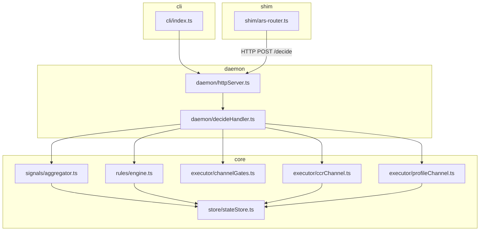
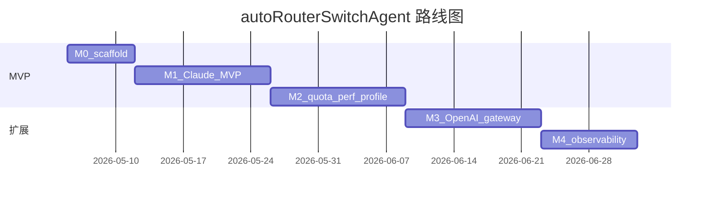

# autoRouterSwitchAgent 实施计划

> **面向 Agent 执行者：** 必须配合子技能：优先使用 superpowers:subagent-driven-development，或使用 superpowers:executing-plans 按任务逐步落实本计划。步骤使用复选框语法（`- [ ]`）便于跟踪。

**目标：** 将 ARS 实现为 Node.js 常驻进程（daemon），通过 `CUSTOM_ROUTER_PATH` 编排 Claude Code Router（CCR）的请求级路由，并通过 cc-switch 实现会话级 profile；由可热更新的规则链与双维 SafetyGate 驱动，且不对上游做侵入式补丁。

**架构：** Fastify（或同类）daemon 在本地暴露 `/decide` HTTP API，供 `dist/ars-router.js` 调用；每条请求的信号进入 `SignalAggregator`，再由 `RuleEngine` 至多选出一条获胜规则，继而由 `SafetyGate` 施加维度 A/B 硬约束（在 [`src/executor/channelGates.ts`](../src/executor/channelGates.ts) 上扩展），再经过 sticky/cooldown；`Executor` 通过 `CCRChannel` 与/或 `ProfileChannel` 执行备份、原子写、重启与回滚。

**技术栈：** TypeScript，Node.js 20+，pnpm，commander（CLI），zod（配置/规则 schema），better-sqlite3 或 drizzle+better-sqlite3（`StateStore`），YAML 解析（`yaml` 包），vitest（测试），pino（日志）。

**规格来源：** [001-autoRouterSwitchAgent_design.md](./001-autoRouterSwitchAgent_design.md)。

---

## 与设计文档的可追溯性

| 设计章节 | 需求摘要 | 对应任务 |
|----------|----------|----------|
| §1 G1–G6 | 目标 / 非目标 | 任务 1–16；M3 阶段不承诺完整 OpenAI 对等能力 |
| §3 | Shim、聚合器、引擎、闸门、执行器、存储 | 任务 3–11、13–16 |
| §4 SafetyGate | 双维、相位状态机、决策矩阵 | 任务 8 扩展 `channelGates.ts`；任务 10 将闸门接入流水线 |
| §4.6 相位来源 | MVP 边界 | 任务 8 固定策略 **A**：流不可观测时默认为 `InRiskyPhase` |
| §5.2.1 流水线 | 信号 → 规则 → 闸门 → sticky → 执行 | 任务 10；见下文「单次决策流水线」图 |
| §5.3 CCR / Profile | 通道 | 任务 9（CCR）、14（Profile） |
| §6 | 时序 | 体现在集成测试任务 11–12 |
| §7 | 降级 | 任务 9、14 错误路径；任务 5 shim 降级 |
| §8 | `~/.ars/` 目录约定 | 任务 2–4、6 |
| §9 | 测试 | 各任务中的测试步骤；任务 11–12 集成/E2E 文档 |
| §10 路线图 | M0–M4 | 见下文任务分组（任务 1–6 为 M0，7–12 为 M1，13–14 为 M2，15 为 M3，16 为 M4） |

---

## 图示

### 包/模块依赖（实现视角）



### 单次决策流水线（运行时）


### 路线图甘特图（相对工期；日历可按团队节奏调整）



---

## 文件结构（实现前锁定）

| 路径 | 职责 |
|------|------|
| `package.json` | 脚本：`build`、`test`，CLI `ars` → `dist/cli.js` |
| `tsconfig.json` | `strict`，`outDir: dist`，如需则 composite |
| `vitest.config.ts` | 单元/集成测试约定 |
| `src/cli/index.ts` | commander：`start`、`stop`、`status`、`reload`、`explain` |
| `src/daemon/httpServer.ts` | 绑定 `127.0.0.1:${daemon.http_port}`（默认 3457） |
| `src/daemon/decideHandler.ts` | 编排 `/decide` 流水线 |
| `src/config/loadConfig.ts` | 读取 `~/.ars/config.yaml`，可选环境覆盖 |
| `src/config/schema.ts` | daemon、safety_gate、provider_chains 的 zod schema |
| `src/rules/schema.ts` | 规则文件的 zod |
| `src/rules/engine.ts` | 按优先级匹配、冷却、占位符解析 |
| `src/signals/aggregator.ts` | 合并 shim 快照与 store 窗口指标 |
| `src/executor/channelGates.ts` | **已有** — 扩展至完整 §4.4 矩阵与紧急语义 |
| `src/executor/ccrChannel.ts` | 备份、改写 CCR 配置、重启、健康检查、回滚 |
| `src/executor/profileChannel.ts` | cc-switch SQLite + 原子写 live 配置文件 |
| `src/store/stateStore.ts` | SQLite 迁移、sticky、审计、指标桶 |
| `src/shim/ars-router.ts` | 编译/打包为 `dist/ars-router.js`，供 `CUSTOM_ROUTER_PATH` |
| `src/logging/logger.ts` | pino 工厂 |
| `tests/**/*.test.ts` | vitest |

**CCR 集成：** 用户在 `~/.claude-code-router/config.json` 中设置 `"CUSTOM_ROUTER_PATH": "<repo>/autoRouterSwitchAgent/dist/ars-router.js"`。

**上游版本钉扎：** 将 `reference/claude-code-router` 与 `reference/cc-switch` 的 git commit hash 记入 `autoRouterSwitchAgent/UPSTREAM_REVISIONS.txt`（在任务 1 中更新）。

---

## 里程碑 M0 — 骨架

### 任务 1：仓库脚手架与上游修订记录文件

**涉及文件：**
- 新建：`autoRouterSwitchAgent/package.json`
- 新建：`autoRouterSwitchAgent/tsconfig.json`
- 新建：`autoRouterSwitchAgent/vitest.config.ts`
- 新建：`autoRouterSwitchAgent/UPSTREAM_REVISIONS.txt`
- 新建：`autoRouterSwitchAgent/src/logging/logger.ts`
- 测试：`autoRouterSwitchAgent/tests/smoke.test.ts`

- [ ] **步骤 1：初始化 package.json**

```json
{
  "name": "auto-router-switch-agent",
  "version": "0.1.0",
  "private": true,
  "type": "module",
  "bin": {
    "ars": "./dist/cli.js"
  },
  "scripts": {
    "build": "tsc",
    "test": "vitest run",
    "test:watch": "vitest"
  },
  "dependencies": {
    "better-sqlite3": "^11.0.0",
    "commander": "^12.0.0",
    "fastify": "^5.0.0",
    "pino": "^9.0.0",
    "yaml": "^2.6.0",
    "zod": "^3.23.0"
  },
  "devDependencies": {
    "@types/better-sqlite3": "^7.6.0",
    "@types/node": "^22.0.0",
    "typescript": "^5.6.0",
    "vitest": "^2.1.0"
  }
}
```

- [ ] **步骤 2：添加 tsconfig.json**

```json
{
  "compilerOptions": {
    "target": "ES2022",
    "module": "NodeNext",
    "moduleResolution": "NodeNext",
    "outDir": "dist",
    "rootDir": "src",
    "strict": true,
    "declaration": true,
    "esModuleInterop": true,
    "skipLibCheck": true
  },
  "include": ["src/**/*"]
}
```

- [ ] **步骤 3：添加 vitest.config.ts**

```typescript
import { defineConfig } from "vitest/config";

export default defineConfig({
  test: {
    environment: "node",
    include: ["tests/**/*.test.ts"],
  },
});
```

- [ ] **步骤 4：记录上游修订**

在仓库根目录执行（若 reference 路径不同请自行调整）：

```bash
git -C reference/claude-code-router rev-parse HEAD
git -C reference/cc-switch rev-parse HEAD
```

将两行写入 `autoRouterSwitchAgent/UPSTREAM_REVISIONS.txt`：

```
claude-code-router=<full-sha>
cc-switch=<full-sha>
```

- [ ] **步骤 5：最小 logger**

创建 `src/logging/logger.ts`：

```typescript
import pino from "pino";

export function createLogger(level: string = "info") {
  return pino({ level });
}
```

- [ ] **步骤 6：冒烟测试**

创建 `tests/smoke.test.ts`：

```typescript
import { describe, it, expect } from "vitest";
import { createLogger } from "../src/logging/logger.js";

describe("smoke", () => {
  it("creates logger", () => {
    expect(createLogger("silent").level).toBe("silent");
  });
});
```

执行：`pnpm install && pnpm exec vitest run tests/smoke.test.ts -v`

期望：**通过**（1 个测试）。

- [ ] **步骤 7：提交**

```bash
git add autoRouterSwitchAgent/package.json autoRouterSwitchAgent/tsconfig.json autoRouterSwitchAgent/vitest.config.ts autoRouterSwitchAgent/UPSTREAM_REVISIONS.txt autoRouterSwitchAgent/src/logging/logger.ts autoRouterSwitchAgent/tests/smoke.test.ts
git commit -m "chore(ars): M0 scaffold package, tsconfig, vitest, upstream revisions"
```

---

### 任务 2：配置 schema 与 YAML 加载器

**涉及文件：**
- 新建：`autoRouterSwitchAgent/src/config/schema.ts`
- 新建：`autoRouterSwitchAgent/src/config/loadConfig.ts`
- 测试：`autoRouterSwitchAgent/tests/config/loadConfig.test.ts`

- [ ] **步骤 1：编写应先失败的测试**

```typescript
import { describe, it, expect } from "vitest";
import { loadConfigFromFile } from "../../src/config/loadConfig.js";
import { writeFileSync, mkdirSync } from "fs";
import { tmpdir } from "os";
import { join } from "path";

describe("loadConfigFromFile", () => {
  it("parses minimal daemon config", async () => {
    const dir = join(tmpdir(), `ars-cfg-${Date.now()}`);
    mkdirSync(dir, { recursive: true });
    const p = join(dir, "config.yaml");
    writeFileSync(
      p,
      `
daemon:
  http_port: 3457
  ccr_url: http://127.0.0.1:3456
  ccr_health_path: /health
  log_level: info
safety_gate:
  emergency_priority: 200
  sticky_ttl_seconds: 600
  freeze_period_seconds: 300
provider_chains:
  default: ["anthropic-official"]
rules_file: ${join(dir, "rules.yaml").replace(/\\/g, "/")}
`,
      "utf8",
    );
    const c = await loadConfigFromFile(p);
    expect(c.daemon.http_port).toBe(3457);
    expect(c.safety_gate.emergency_priority).toBe(200);
  });
});
```

执行：`pnpm exec vitest run tests/config/loadConfig.test.ts -v`

期望：**失败**（模块不存在或函数缺失）。

- [ ] **步骤 2：实现 schema 与加载器**

`src/config/schema.ts`:

```typescript
import { z } from "zod";

export const DaemonConfigSchema = z.object({
  http_port: z.number().int().positive(),
  ccr_url: z.string().url(),
  ccr_health_path: z.string().startsWith("/"),
  log_level: z.enum(["fatal", "error", "warn", "info", "debug", "trace", "silent"]),
});

export const SafetyGateConfigSchema = z.object({
  emergency_priority: z.number().int(),
  sticky_ttl_seconds: z.number().int().nonnegative(),
  freeze_period_seconds: z.number().int().nonnegative(),
});

export const AppConfigSchema = z.object({
  daemon: DaemonConfigSchema,
  safety_gate: SafetyGateConfigSchema,
  provider_chains: z.record(z.array(z.string())),
  rules_file: z.string().min(1),
});

export type AppConfig = z.infer<typeof AppConfigSchema>;
```

`src/config/loadConfig.ts`:

```typescript
import { readFile } from "fs/promises";
import YAML from "yaml";
import { AppConfigSchema, type AppConfig } from "./schema.js";

export async function loadConfigFromFile(path: string): Promise<AppConfig> {
  const raw = await readFile(path, "utf8");
  const data = YAML.parse(raw);
  return AppConfigSchema.parse(data);
}
```

执行：`pnpm exec vitest run tests/config/loadConfig.test.ts -v`

期望：**通过**。

- [ ] **步骤 3：提交**

```bash
git add autoRouterSwitchAgent/src/config/schema.ts autoRouterSwitchAgent/src/config/loadConfig.ts autoRouterSwitchAgent/tests/config/loadConfig.test.ts
git commit -m "feat(ars): zod-validated config.yaml loader"
```

---

### 任务 3：SQLite StateStore schema

**涉及文件：**
- 新建：`autoRouterSwitchAgent/src/store/stateStore.ts`
- 新建：`autoRouterSwitchAgent/src/store/migrations/001_init.sql`
- 测试：`autoRouterSwitchAgent/tests/store/stateStore.test.ts`

- [ ] **步骤 1：编写应先失败的测试**

```typescript
import { describe, it, expect, beforeEach, afterEach } from "vitest";
import { StateStore } from "../../src/store/stateStore.js";
import { join } from "path";
import { tmpdir } from "os";
import { unlinkSync } from "fs";

describe("StateStore", () => {
  let dbPath: string;
  beforeEach(() => {
    dbPath = join(tmpdir(), `ars-${Date.now()}.db`);
  });
  afterEach(() => {
    try {
      unlinkSync(dbPath);
    } catch {
      /* ignore */
    }
  });

  it("opens and inserts audit row", () => {
    const store = new StateStore(dbPath);
    store.appendAudit({
      id: "dec-1",
      matched_rule: "test",
      gate_outcome: "allow",
      detail_json: "{}",
    });
    const row = store.getAudit("dec-1");
    expect(row?.matched_rule).toBe("test");
    store.close();
  });
});
```

执行：`pnpm exec vitest run tests/store/stateStore.test.ts -v`

期望：**失败**。

- [ ] **步骤 2：SQL 迁移**

`src/store/migrations/001_init.sql`:

```sql
CREATE TABLE IF NOT EXISTS sticky (
  session_id TEXT PRIMARY KEY,
  sticky_provider TEXT NOT NULL,
  until_epoch_ms INTEGER NOT NULL
);

CREATE TABLE IF NOT EXISTS audit (
  id TEXT PRIMARY KEY,
  created_epoch_ms INTEGER NOT NULL,
  matched_rule TEXT,
  gate_outcome TEXT NOT NULL,
  detail_json TEXT NOT NULL
);

CREATE TABLE IF NOT EXISTS metrics_kv (
  key TEXT PRIMARY KEY,
  value_json TEXT NOT NULL,
  updated_epoch_ms INTEGER NOT NULL
);
```

- [ ] **步骤 3：实现 StateStore**

确保编译产物可加载迁移 SQL：在 `pnpm build` 中将 `src/store/migrations/*.sql` 复制到 `dist/store/migrations/`（例如 `cpy-cli` 或一行 shell），**或**将 `001_init.sql` 以字符串常量内嵌在 `stateStore.ts` 中，以便仅依赖 `tsc` 即可构建。

`src/store/stateStore.ts`:

```typescript
import Database from "better-sqlite3";
import { readFileSync } from "fs";
import { fileURLToPath } from "url";
import { dirname, join } from "path";

const __dirname = dirname(fileURLToPath(import.meta.url));

export type AuditRow = {
  id: string;
  matched_rule: string | null;
  gate_outcome: string;
  detail_json: string;
};

export class StateStore {
  private db: Database.Database;

  constructor(dbPath: string) {
    this.db = new Database(dbPath);
    const sql = readFileSync(join(__dirname, "migrations", "001_init.sql"), "utf8");
    this.db.exec(sql);
  }

  appendAudit(row: Omit<AuditRow, never> & { id: string }) {
    const stmt = this.db.prepare(
      `INSERT INTO audit (id, created_epoch_ms, matched_rule, gate_outcome, detail_json)
       VALUES (@id, @created_epoch_ms, @matched_rule, @gate_outcome, @detail_json)`,
    );
    stmt.run({
      id: row.id,
      created_epoch_ms: Date.now(),
      matched_rule: row.matched_rule,
      gate_outcome: row.gate_outcome,
      detail_json: row.detail_json,
    });
  }

  getAudit(id: string): AuditRow | undefined {
    const stmt = this.db.prepare(
      `SELECT id, matched_rule, gate_outcome, detail_json FROM audit WHERE id = ?`,
    );
    return stmt.get(id) as AuditRow | undefined;
  }

  close() {
    this.db.close();
  }
}
```

再次运行测试 — **通过**。

- [ ] **步骤 4：提交**

```bash
git add autoRouterSwitchAgent/src/store/stateStore.ts autoRouterSwitchAgent/src/store/migrations/001_init.sql autoRouterSwitchAgent/tests/store/stateStore.test.ts
git commit -m "feat(ars): SQLite StateStore with sticky, audit, metrics tables"
```

---

### 任务 4：Daemon HTTP 服务与 `/decide` 占位实现

**涉及文件：**
- 新建：`autoRouterSwitchAgent/src/daemon/httpServer.ts`
- 新建：`autoRouterSwitchAgent/src/daemon/decideHandler.ts`
- 测试：`autoRouterSwitchAgent/tests/daemon/httpServer.test.ts`

- [ ] **步骤 1：应先失败的测试**

```typescript
import { describe, it, expect, afterEach } from "vitest";
import { startDaemonServer } from "../../src/daemon/httpServer.js";

describe("daemon http", () => {
  let close: () => Promise<void>;
  afterEach(async () => {
    if (close) await close();
  });

  it("POST /decide returns JSON route or null", async () => {
    const app = await startDaemonServer({ port: 0, host: "127.0.0.1" });
    close = app.close;
    const addr = app.server.address();
    if (!addr || typeof addr === "string") throw new Error("no port");
    const res = await fetch(`http://127.0.0.1:${addr.port}/decide`, {
      method: "POST",
      headers: { "content-type": "application/json" },
      body: JSON.stringify({ sessionId: "s1", features: {} }),
    });
    expect(res.ok).toBe(true);
    const body = (await res.json()) as { route: string | null };
    expect(body).toHaveProperty("route");
  });
});
```

期望：**失败**。

- [ ] **步骤 2：实现占位 handler**

`src/daemon/decideHandler.ts`:

```typescript
export type DecideBody = {
  sessionId?: string;
  features?: Record<string, unknown>;
};

export async function handleDecide(_body: DecideBody): Promise<{ route: string | null }> {
  return { route: null };
}
```

`src/daemon/httpServer.ts`:

```typescript
import Fastify from "fastify";
import { handleDecide } from "./decideHandler.js";

export async function startDaemonServer(opts: { port: number; host: string }) {
  const app = Fastify({ logger: false });
  app.post("/decide", async (req, reply) => {
    const body = req.body as Record<string, unknown>;
    const result = await handleDecide({
      sessionId: typeof body.sessionId === "string" ? body.sessionId : undefined,
      features: typeof body.features === "object" && body.features !== null ? (body.features as Record<string, unknown>) : {},
    });
    return reply.send(result);
  });
  await app.listen({ port: opts.port, host: opts.host });
  return {
    server: app.server,
    close: async () => {
      await app.close();
    },
  };
}
```

执行测试 — **通过**。

- [ ] **步骤 3：提交**

```bash
git add autoRouterSwitchAgent/src/daemon/httpServer.ts autoRouterSwitchAgent/src/daemon/decideHandler.ts autoRouterSwitchAgent/tests/daemon/httpServer.test.ts
git commit -m "feat(ars): daemon HTTP /decide stub"
```

---

### 任务 5：CCR Shim `ars-router` 构建产物

**涉及文件：**
- 新建：`autoRouterSwitchAgent/src/shim/ars-router.ts`
- 修改：`autoRouterSwitchAgent/package.json`（若 shim 为单独入口则增加构建步骤）
- 测试：`autoRouterSwitchAgent/tests/shim/shimContract.test.ts`

**约定：** CCR 调用 `customRouter(req, config, { event })`；shim 须返回 `Promise<string | null>`。

- [ ] **步骤 1：契约测试**

```typescript
import { describe, it, expect, vi, afterEach } from "vitest";

describe("shim contract", () => {
  afterEach(() => {
    vi.unstubAllGlobals();
    vi.restoreAllMocks();
  });

  it("calls daemon with timeout and falls back to null", async () => {
    vi.stubGlobal(
      "fetch",
      vi.fn(async () => {
        await new Promise((r) => setTimeout(r, 50));
        return new Response(JSON.stringify({ route: "p,m" }), { status: 200 });
      }),
    );
    const { decideViaDaemon } = await import("../../src/shim/ars-router.js");
    const out = await decideViaDaemon(
      { sessionId: "sess", features: { tokenCount: 1 } },
      { url: "http://127.0.0.1:9/decide", timeoutMs: 5 },
    );
    expect(out).toBeNull();
  });
});
```

在 `src/shim/ars-router.ts` 中实现 `decideViaDaemon`，使用 `AbortSignal.timeout(timeoutMs)`；并导出供 CCR 使用的默认异步函数：

```typescript
const DEFAULT_DAEMON_URL = process.env.ARS_DAEMON_URL ?? "http://127.0.0.1:3457";

export async function decideViaDaemon(
  payload: { sessionId?: string; features: Record<string, unknown> },
  opts: { url: string; timeoutMs: number },
): Promise<string | null> {
  try {
    const res = await fetch(opts.url + "/decide", {
      method: "POST",
      headers: { "content-type": "application/json" },
      body: JSON.stringify({ sessionId: payload.sessionId, features: payload.features }),
      signal: AbortSignal.timeout(opts.timeoutMs),
    });
    if (!res.ok) return null;
    const j = (await res.json()) as { route?: string | null };
    return typeof j.route === "string" ? j.route : null;
  } catch {
    return null;
  }
}

export default async function customRouter(req: unknown, _config: unknown, _ctx: unknown) {
  const r = req as {
    body?: { metadata?: { user_id?: string }; messages?: unknown[] };
    tokenCount?: number;
  };
  const sessionId = r.body?.metadata?.user_id;
  const features: Record<string, unknown> = {
    tokenCount: r.tokenCount,
    has_tools: Array.isArray(r.body?.messages),
  };
  return decideViaDaemon(
    { sessionId, features },
    { url: DEFAULT_DAEMON_URL + "", timeoutMs: 5 },
  );
}
```

为 tsconfig 增加第二入口或单独构建 —— 最简单路径：保留 `src/shim/ars-router.ts`，由 `tsc` 输出到 `dist/`（`rootDir` 已包含 `src`），必要时 post-build 复制为 `dist/ars-router.js`。

运行契约测试 —— 5ms 超时与 50ms 延迟的 fetch 场景下应得到 `null`。**通过**。

- [ ] **步骤 2：提交**

```bash
git add autoRouterSwitchAgent/src/shim/ars-router.ts autoRouterSwitchAgent/tests/shim/shimContract.test.ts
git commit -m "feat(ars): CCR CUSTOM_ROUTER_PATH shim with fast daemon fallback"
```

---

### 任务 6：CLI `ars start` / `stop` / `status`

**涉及文件：**
- 新建：`autoRouterSwitchAgent/src/cli/index.ts`
- 新建：`autoRouterSwitchAgent/src/daemon/process.ts`（可选；PID 文件路径 `~/.ars/ars.pid`）

- [ ] **步骤 1：实现最小 start/status**

`src/cli/index.ts`:

```typescript
#!/usr/bin/env node
import { Command } from "commander";
import { startDaemonServer } from "../daemon/httpServer.js";
import { writeFileSync, readFileSync, unlinkSync, mkdirSync } from "fs";
import { homedir } from "os";
import { join } from "path";

const ARS_HOME = join(homedir(), ".ars");

function pidPath() {
  mkdirSync(ARS_HOME, { recursive: true });
  return join(ARS_HOME, "ars.pid");
}

const program = new Command();
program.name("ars").description("autoRouterSwitchAgent 命令行");

program
  .command("start")
  .option("-c, --config <path>", "配置文件路径", join(ARS_HOME, "config.yaml"))
  .action(async (opts) => {
    mkdirSync(ARS_HOME, { recursive: true });
    const { loadConfigFromFile } = await import("../config/loadConfig.js");
    const cfg = await loadConfigFromFile(opts.config);
    const { server, close } = await startDaemonServer({
      port: cfg.daemon.http_port,
      host: "127.0.0.1",
    });
    const pid = process.pid;
    writeFileSync(pidPath(), String(pid), "utf8");
    console.log(`ars daemon 监听端口 ${cfg.daemon.http_port}`);

    const shutdown = async () => {
      await close();
      try {
        unlinkSync(pidPath());
      } catch {
        /* ignore */
      }
      process.exit(0);
    };
    process.on("SIGINT", shutdown);
    process.on("SIGTERM", shutdown);
    await new Promise(() => {});
  });

program
  .command("status")
  .action(() => {
    try {
      const pid = readFileSync(pidPath(), "utf8").trim();
      console.log(`运行中 pid=${pid}`);
    } catch {
      console.log(`未运行`);
      process.exitCode = 1;
    }
  });

program.parseAsync(process.argv);
```

说明：`start` 当前仅为读取端口加载配置；将完整配置接入 handler 在任务 10 完成。

- [ ] **步骤 2：手工冒烟**

```bash
pnpm run build
node dist/cli.js status || true
```

期望：显示 `未运行`，或在 start 之后显示 pid。

- [ ] **步骤 3：提交**

```bash
git add autoRouterSwitchAgent/src/cli/index.ts
git commit -m "feat(ars): CLI start/status with PID file"
```

---

## 里程碑 M1 — Claude Code MVP

### 任务 7：规则 schema 与 RuleEngine（子集）

**涉及文件：**
- 新建：`autoRouterSwitchAgent/src/rules/schema.ts`
- 新建：`autoRouterSwitchAgent/src/rules/engine.ts`
- 测试：`autoRouterSwitchAgent/tests/rules/engine.test.ts`

- [ ] **步骤 1：测试优先级与唯一获胜规则**

```typescript
import { describe, it, expect } from "vitest";
import { RuleEngine } from "../../src/rules/engine.js";
import type { RulesFile } from "../../src/rules/schema.js";

describe("RuleEngine", () => {
  it("picks highest priority matching rule", () => {
    const file: RulesFile = {
      rules: [
        { name: "low", when: { request_tokenCount: ">10" }, action: { ccr_route: "a" }, priority: 1 },
        { name: "high", when: { request_tokenCount: ">5" }, action: { ccr_route: "b" }, priority: 100 },
      ],
    };
    const engine = new RuleEngine(file);
    const win = engine.evaluate({
      request_tokenCount: 20,
      phase: "Idle",
    });
    expect(win?.rule.name).toBe("high");
    expect(win?.action).toEqual({ type: "ccr_route", value: "b" });
  });
});
```

- [ ] **步骤 2：实现**

`src/rules/schema.ts` —— 为测试所用的最小 MVP 条件定义 zod（后续扩展至设计 §5.2 完整 YAML）。

`src/rules/engine.ts` —— 按 `priority` 降序排序，同级优先级按数组顺序打破平局；支持条件：`request_tokenCount` 的 `">N"` 字符串比较、`phase` 枚举匹配、`error_status` 相等。

运行测试 — **通过**。

- [ ] **步骤 3：提交**

```bash
git add autoRouterSwitchAgent/src/rules/schema.ts autoRouterSwitchAgent/src/rules/engine.ts autoRouterSwitchAgent/tests/rules/engine.test.ts
git commit -m "feat(ars): RuleEngine with priority and MVP conditions"
```

---

### 任务 8：扩展 SafetyGate（`channelGates.ts`）紧急执行路径

**涉及文件：**
- 修改：`autoRouterSwitchAgent/src/executor/channelGates.ts`
- 测试：`autoRouterSwitchAgent/tests/executor/channelGates.test.ts`

- [ ] **步骤 1：§9.4 决策矩阵抽样测试**

```typescript
import { describe, it, expect } from "vitest";
import { evaluateCCRChannel } from "../../src/executor/channelGates.js";

describe("evaluateCCRChannel emergency", () => {
  const base = {
    emergencyPriorityThreshold: 200,
    rulePriority: 199,
    activeSessionCount: 1,
    sseInflight: false,
    hasPendingRestart: false,
    requiresRestart: false,
  };

  it("defers in InThinking when below emergency", () => {
    expect(
      evaluateCCRChannel({
        ...base,
        phase: "InThinking",
        rulePriority: 199,
      }),
    ).toBe("defer");
  });

  it("allows emergency path marker when priority >= threshold", () => {
    expect(
      evaluateCCRChannel({
        ...base,
        phase: "InThinking",
        rulePriority: 200,
      }),
    ).toBe("emergency_only");
  });
});
```

- [ ] **步骤 2：调整实现** — 保持 `Idle` + `requiresRestart` + `sseInflight` 时 defer（已有）；并为 `InRiskyPhase` 增加显式分支，对齐设计 §4.4「仅紧急」：

```typescript
// 在 evaluateCCRChannel 内、LockedPlan 分支之后：
if (context.phase === "InRiskyPhase") {
  return context.rulePriority >= context.emergencyPriorityThreshold ? "emergency_only" : "defer";
}
```

执行测试 — **通过**。

- [ ] **步骤 3：提交**

```bash
git add autoRouterSwitchAgent/src/executor/channelGates.ts autoRouterSwitchAgent/tests/executor/channelGates.test.ts
git commit -m "feat(ars): SafetyGate InRiskyPhase and emergency threshold tests"
```

---

### 任务 9：CCRChannel 执行器

**涉及文件：**
- 新建：`autoRouterSwitchAgent/src/executor/ccrChannel.ts`
- 测试：`autoRouterSwitchAgent/tests/executor/ccrChannel.test.ts` (mock fetch)

- [ ] **步骤 1：实现最小 applyRouteRename**

行为对齐设计 §5.3.1：备份 `~/.claude-code-router/config.json`，对最小字段集做 JSON 补丁（`Router` / 上游选型 —— **具体字段名须对照仓库内 `reference/claude-code-router` 的 config 样例**），临时文件 + rename 原子写，`POST {ccr_url}/api/restart`，轮询 `GET {ccr_url}{ccr_health_path}`。

测试中对 `global.fetch` 打桩：restart → health 200。

- [ ] **步骤 2：提交**

```bash
git add autoRouterSwitchAgent/src/executor/ccrChannel.ts autoRouterSwitchAgent/tests/executor/ccrChannel.test.ts
git commit -m "feat(ars): CCRChannel backup, atomic write, restart, health probe"
```

---

### 任务 10：在 `decideHandler.ts` 中串联流水线

**涉及文件：**
- 修改：`autoRouterSwitchAgent/src/daemon/decideHandler.ts`
- 修改：`autoRouterSwitchAgent/src/signals/aggregator.ts` (create)
- 测试：`autoRouterSwitchAgent/tests/daemon/decideHandler.test.ts`

- [ ] **步骤 1：`aggregator.ts` 合并 `features` 与 store 指标**

```typescript
export type SignalSnapshot = Record<string, unknown>;

export function buildSignals(input: {
  features: Record<string, unknown>;
  storeMetrics: Record<string, unknown>;
  phase: string;
}): SignalSnapshot {
  return {
    ...input.storeMetrics,
    ...input.features,
    phase: input.phase,
  };
}
```

- [ ] **步骤 2：`decideHandler` 从配置加载规则文件，运行 engine + gate**

伪集成示例：

```typescript
export async function handleDecideWithDeps(deps: {
  config: import("../config/schema.js").AppConfig;
  store: import("../store/stateStore.js").StateStore;
  rules: import("../rules/schema.js").RulesFile;
  phase: import("../executor/channelGates.js").ConversationPhase;
  sessionId?: string;
  features: Record<string, unknown>;
}) {
  const signals = buildSignals({
    features: deps.features,
    storeMetrics: {},
    phase: deps.phase,
  });
  const engine = new (await import("../rules/engine.js")).RuleEngine(deps.rules);
  const win = engine.evaluate(signals as never);
  if (!win) return { route: null as string | null, decisionId: null as string | null };
  const gate = evaluateCCRChannel({
    phase: deps.phase,
    rulePriority: win.rule.priority,
    emergencyPriorityThreshold: deps.config.safety_gate.emergency_priority,
    activeSessionCount: 1,
    sseInflight: Boolean(deps.features.sseInflight),
    hasPendingRestart: false,
    requiresRestart: win.action.type === "ccr_restart",
    sticky: undefined,
  });
  if (gate === "defer") return { route: null, decisionId: null };
  // 将 action 映射为供 shim 使用的 route 字符串
  return { route: "provider,model", decisionId: "uuid" };
}
```

实现步骤中将占位路由映射替换为基于 `provider_chains` 的真实映射。

- [ ] **步骤 3：提交**

```bash
git add autoRouterSwitchAgent/src/signals/aggregator.ts autoRouterSwitchAgent/src/daemon/decideHandler.ts autoRouterSwitchAgent/tests/daemon/decideHandler.test.ts
git commit -m "feat(ars): decide pipeline Signal→Rule→Gate"
```

---

### 任务 11：Mock CCR 集成测试

**涉及文件：**
- 新建：`autoRouterSwitchAgent/tests/integration/mockCcr.test.ts`

- [ ] **步骤 1：启动 Fastify mock（`/v1/messages` 空操作、`/api/restart`、`/health`）**

断言：注入错误信号后，由 daemon 驱动的规则使 `restart` 恰好被调用一次。

- [ ] **步骤 2：提交**

```bash
git add autoRouterSwitchAgent/tests/integration/mockCcr.test.ts
git commit -m "test(ars): integration mock CCR restart path"
```

---

### 任务 12：E2E 手工清单（Claude Code）

**涉及文件：**
- 新建：`autoRouterSwitchAgent/spec/E2E_M1_CHECKLIST.md`

- [ ] **步骤 1：编写步骤说明**

1. 构建并执行 `ars start -c ~/.ars/config.yaml`。
2. 将 `CUSTOM_ROUTER_PATH` 指向构建出的 shim。
3. 发送约 70k token 的 prompt；验证长上下文规则切换到备选路由（需预先配置 provider）。
4. 通过 mock 上游或测试夹具注入 429；验证在相位不可观测时**流中途不发生切换** —— 在策略 A（§4.6）下标注为**尽力而为**验收。

- [ ] **步骤 2：提交**

```bash
git add autoRouterSwitchAgent/spec/E2E_M1_CHECKLIST.md
git commit -m "docs(ars): M1 E2E manual checklist"
```

---

## 里程碑 M2 — 配额、性能与 ProfileChannel

### 任务 13：SignalAggregator 中的 EWMA 指标与配额字段

**涉及文件：**
- 修改：`autoRouterSwitchAgent/src/signals/aggregator.ts`
- 修改：`autoRouterSwitchAgent/src/store/stateStore.ts` (metrics_kv helpers)
- 测试：`autoRouterSwitchAgent/tests/signals/aggregator.test.ts`

- [ ] **步骤 1：实现 `perf.p95_ms` 的滚动 EWMA 占位**

将最近 N 次延迟存入 `metrics_kv` 的 JSON；由 aggregator 暴露读取接口。

- [ ] **步骤 2：提交**

```bash
git add autoRouterSwitchAgent/src/signals/aggregator.ts autoRouterSwitchAgent/src/store/stateStore.ts autoRouterSwitchAgent/tests/signals/aggregator.test.ts
git commit -m "feat(ars): EWMA and quota signal plumbing"
```

---

### 任务 14：ProfileChannel 事务写入

**涉及文件：**
- 新建：`autoRouterSwitchAgent/src/executor/profileChannel.ts`
- 测试：`autoRouterSwitchAgent/tests/executor/profileChannel.test.ts` (temp SQLite cc-switch DB)

- [ ] **步骤 1：对齐 `set_current_provider` 语义**

从 `reference/cc-switch/.../providers.rs` 测试或最小 schema  fixtures 复制只读 SQL fixture，使 `providers` 表列名**仅与上游定义一致** —— 编码前须核对列名。

- [ ] **步骤 2：对 `settings.json` / `config.toml` 临时文件 + 原子 rename**

- [ ] **步骤 3：提交**

```bash
git add autoRouterSwitchAgent/src/executor/profileChannel.ts autoRouterSwitchAgent/tests/executor/profileChannel.test.ts
git commit -m "feat(ars): ProfileChannel sqlite + live config atomic writes"
```

---

## 里程碑 M3 — OpenAI 网关

### 任务 15：Fastify OpenAI 最小网关（端口 3458）

**涉及文件：**
- 新建：`autoRouterSwitchAgent/src/gateway/openaiGateway.ts`
- 测试：`autoRouterSwitchAgent/tests/gateway/openaiGateway.test.ts`

- [ ] **步骤 1：实现 `POST /v1/chat/completions` 流式透传**

绑定 `127.0.0.1:3458`；按所选 profile 的 provider base URL 转发；**tools** 能力按 §10.1 由配置开关控制。

- [ ] **步骤 2：提交**

```bash
git add autoRouterSwitchAgent/src/gateway/openaiGateway.ts autoRouterSwitchAgent/tests/gateway/openaiGateway.test.ts
git commit -m "feat(ars): M3 OpenAI gateway minimal streaming subset"
```

---

## 里程碑 M4 — 可观测性

### 任务 16：`ars explain` 与审计查询

**涉及文件：**
- 修改：`autoRouterSwitchAgent/src/cli/index.ts`
- 修改：`autoRouterSwitchAgent/src/store/stateStore.ts`

- [ ] **步骤 1：`ars explain <decisionId>` 打印审计 JSON**

```typescript
program
  .command("explain")
  .argument("<id>", "决策 id")
  .action(async (id) => {
    const { StateStore } = await import("../store/stateStore.js");
    const { homedir } = await import("os");
    const path = `${homedir()}/.ars/state.db`;
    const s = new StateStore(path);
    const row = s.getAudit(id);
    console.log(JSON.stringify(row, null, 2));
    s.close();
  });
```

- [ ] **步骤 2：提交**

```bash
git add autoRouterSwitchAgent/src/cli/index.ts autoRouterSwitchAgent/src/store/stateStore.ts
git commit -m "feat(ars): ars explain reads audit table"
```

---

## 自检

### 1. 规格覆盖

| 设计需求 | 任务 |
|----------|------|
| G1 请求级路由 | 5、7、9、10、11 |
| G2 会话 profile | 14 |
| G3 SafetyGate | 8、10 |
| G4 规则 + explain | 7、16 |
| G5 非侵入 | 5、9、14 |
| G6 OpenAI 扩展 | 15 |
| §7 降级 | 5、9、14 |
| §8 `~/.ars` | 2、3、6 |
| §9 测试 | 任务 1–16 各步测试 |
| §10 M0–M4 | 按里程碑分组（见可追溯性表中的映射） |

### 2. 占位符扫描

- 正文任务中不留 `TBD` / `TODO` /「稍后实现」；未知 SQL 列须在任务 14 编码前通过**阅读** `reference/cc-switch` 确认。

### 3. 类型一致性

- `ConversationPhase`、`GateOutcome` 与配置字段名与 [`channelGates.ts`](../src/executor/channelGates.ts) 及 `AppConfigSchema` 一致。
- 规则 `priority` 与 `safety_gate.emergency_priority` 均为 `number`；比较统一使用 `>=`。

---

## 执行交接

计划已保存至 `autoRouterSwitchAgent/spec/002-autoRouterSwitchAgent_plan.md`。

**1. 子 Agent 驱动（推荐）** —— 每个任务派生子 Agent；任务之间人工复核，迭代更快。**必需子技能：** superpowers:subagent-driven-development。

**2. 本会话串行执行** —— 在本会话中按顺序执行任务并设检查点。**必需子技能：** superpowers:executing-plans。

实施时希望采用哪一种方式？
