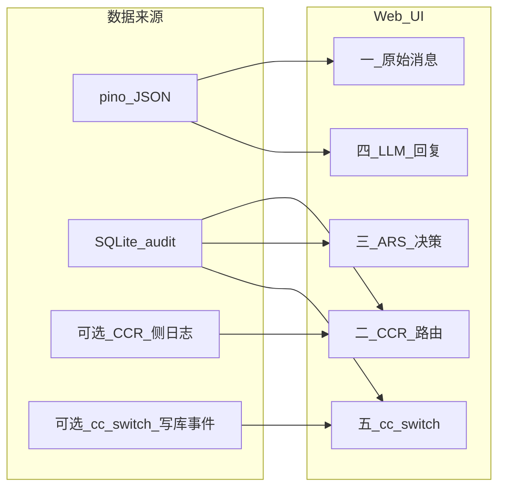

# 路由日志 Web 可视化 — 规格说明

> **版本**：v1
> **状态**：规格（对齐 [001-autoRouterSwitchAgent_design.md](./001-autoRouterSwitchAgent_design.md)）
> **实现计划**：[004-log-visualization-implementation-plan.md](./004-log-visualization-implementation-plan.md)
> **关联里程碑**：[001 §10 / M4 可观测](001-autoRouterSwitchAgent_design.md)、[002 里程碑 M4 — 任务 16](002-autoRouterSwitchAgent_plan.md)

本文定义 **autoRouterSwitchAgent（ARS）** 路由与决策链路的 **Web 可观测 UI**：展示原始请求、CCR 路由、ARS 决策、LLM 回复摘要、cc-switch 写入情况。实现应 **复用** 既有产物：`StateStore` 审计表、`ars explain`、pino JSON（`~/.ars/logs/`）、daemon HTTP（默认 `127.0.0.1:3457`），避免与 CLI 审计能力重复造轮子。

---

## 1. 与设计文档的衔接

| 设计要点 | 本文对应 |
|----------|----------|
| G4 可审计、可回放（`ars explain`） | §3 UI 与 §8 API 直接消费审计行；提供与 CLI 等价的 explain 视图 |
| StateStore 审计日志 | §2 数据来源 `Audit`；§5 面板三 |
| pino JSON（`~/.ars/logs/`） | §2 `Pino`；§5 面板一、四 |
| daemon HTTP 默认 3457 | §7 方案 A；§8 只读 REST |
| M4 可观测：`ars explain`、审计页面、（可选）轻量 web 状态页 | §9 与 M4 / 任务 16 对齐 |
| §4.6 相位观测边界 | §5 面板一、三、四中 **MVP vs 可选** 划分 |

---

## 2. 关联键与脱敏策略

### 2.1 关联键（须在结构化日志与审计写入中保持一致）

UI 按下列键把五个面板串成一条追踪链；实现侧应在 **pino 每条相关日志** 与 **SQLite 审计行** 中尽可能携带相同字段名（缺失时用 §2.2 时间窗口兜底）。

| 键 | 含义 | 典型来源 |
|----|------|----------|
| `requestId` | 单次 HTTP `/v1/messages`（或等价入口）与 shim 调用 | CCR 请求 id / daemon 生成 UUID |
| `sessionId` | 多轮会话、sticky、SafetyGate 相位状态机 | Anthropic 请求体或会话头 |
| `decisionId` | 一次裁决记录，对应 `ars explain <decisionId>` | SQLite `audit` 表主键或等价 |
| `timestamp` | 事件时间（ISO8601 或 Unix ms） | 日志落盘时间 / DB 写入时间 |

**关联优先级**：优先 `requestId` 精确匹配；若无，则用 `sessionId` + 时间窗口（建议默认 ±60s，可配置）；再不行仅用时间线排序并标注「弱关联」。

### 2.2 脱敏规则（UI 与 API 默认行为）

- **API Key / Bearer**：显示为 `***` 或前 4 后 4 字符；可复制完整值须 **显式二次确认**（默认关闭）。
- **用户主目录与绝对路径**：可配置为仅显示末级目录名 + `~` 占位。
- **请求/响应 body**：默认折叠；展开前提示「可能含敏感内容」。
- **cc-switch / profile 密钥字段**：仅展示校验摘要（hash 短串）或「已设置 / 未设置」，不展示明文。

---

## 3. 数据来源与摄取

| 来源 | MVP | 可选 |
|------|-----|------|
| ARS pino | 必填 | 分级（debug）字段 |
| SQLite 审计 | 必填 | 历史迁移脚本 |
| CCR 进程日志 | 不纳入 | 接入后展示 restart、上游错误详情 |
| cc-switch DB 变更事件 | 由 ARS **审计写入** 间接体现 | 直连 cc-switch SQLite 只读镜像 |

---

## 4. Web UI 共性能力

- **时间线**：默认按时间倒序；可选 **按 `sessionId` 聚合** 会话视图。
- **筛选**：仅错误、仅 defer、仅 ProfileChannel、按规则 id、按 `decisionId`。
- **关联跳转**：从任意一行打开同一 `requestId` / `sessionId` / `decisionId` 的其他面板并高亮。
- **安全**：默认绑定 **127.0.0.1**；可选静态 token；不提供面向公网的默认配置。

---

## 5. 分面板字段清单（MVP / 可选）

### 5.1 一、原始消息相关

**目的**：本次请求的形态与请求特征信号（对齐 SignalAggregator / shim）。

| 内容 | MVP | 可选 |
|------|-----|------|
| token 估计、`messages` 条数 | ✓ | — |
| 长上下文标签（阈值来自配置） | ✓ | — |
| thinking / tool_use / Plan 标签 | ✓（可推断） | 标明「推断」与 §4.6 **InRiskyPhase** 一致 |
| `sessionId`、client 元数据 | ✓（若有） | — |
| 可折叠 JSON body（脱敏后） | ✓ | 完整导出（文件下载 + 警告） |

### 5.2 二、CCR 路由情况

**目的**：CCR + shim 视角下的路由结果与进程侧动作。

| 内容 | MVP | 可选 |
|------|-----|------|
| shim 可见摘要：`tokenCount`、与路由相关的 `req` 字段 | ✓ | 完整 `req` 调试树 |
| 返回值：`"provider,model"` 或 `null` | ✓ | — |
| 429/5xx/超时等与上游可对齐的错误码 | ✓ | — |
| CCR 热改 / `POST /api/restart` 事件与时间 | — | ✓（需 CCR 侧日志或 ARS 执行记录） |

### 5.3 三、autoRouterSwitchAgent 决策情况

**目的**：与 `ars explain`、G4 审计一致 —— 规则为何触发、闸门结论、最终动作。

| 内容 | MVP | 可选 |
|------|-----|------|
| 四类信号摘要（错误、配额、请求特征、性能滑窗） | ✓ | 原始指标片段 |
| 匹配规则 id、优先级、候选动作类型（CCR 仅路由 / CCR+restart / ProfileChannel） | ✓ | — |
| SafetyGate：维度 A 相位、维度 B 各闸门结果（允许 / defer_until_Idle / 仅紧急） | ✓ | 完整判定树 JSON |
| sticky、cooldown 二次否决 | ✓ | — |
| `decisionId`、是否写入审计表 | ✓ | — |
| 一键复制 `ars explain <decisionId>` | ✓ | 内嵌 explain 全文 Diff |

### 5.4 四、LLM 回复情况

**目的**：上游调用是否成功、耗时、流是否完整（完整 SSE 正文受 §4.6 约束）。

| 内容 | MVP | 可选 |
|------|-----|------|
| HTTP status、首字节延迟、总时长、流是否正常结束 | ✓ | — |
| finish_reason、tool_calls 次数、错误体摘要 | ✓（若 pino/网关上报） | — |
| 完整 SSE / 响应正文 | — | ✓（仅当 CCR 扩展钩子或侧车采集可用时） |

### 5.5 五、cc-switch 情况

**目的**：ProfileChannel 写入意图、是否 quiesce、原子写结果（对齐 §4.3、§7）。

| 内容 | MVP | 可选 |
|------|-----|------|
| 目标 profile、影响的配置文件路径（矩阵见 [001 §3.3](001-autoRouterSwitchAgent_design.md)） | ✓ | — |
| SQLite / 多文件原子写成功或失败摘要 | ✓ | 写前写后 hash |
| GlobalProfileImpact：是否延迟至 Idle | ✓ | 与 GUI 并发写告警文案 |
| EffectiveApply：需新终端等警告 | ✓ | — |

---

## 6. 非目标（防止范围膨胀）

- MVP **不包含** 完整 SSE 响应正文存储与展示，除非实现 [001 §4.6](001-autoRouterSwitchAgent_design.md) 受控扩展或明确侧车方案。
- 不替代 **cc-switch GUI**；本 UI 以 **只读观测与审计** 为主。
- 默认不包含 **外置** Loki/Grafana 栈；若后续需要检索增强，另立规格。

---

## 7. 选定实现路径（MVP）

采用 **方案 A：daemon 集成轻量只读 Web**

| 项 | 说明 |
|----|------|
| 后端 | 在现有 `127.0.0.1:${daemon.http_port}`（默认 **3457**）上提供 **只读 REST**：分页查询 SQLite 审计、分页/游标读取 pino 解析结果 |
| 前端 | 静态资源置于 daemon `public/` 或与二进制同发的 `dist/web/`，单页应用可选极简原生 JS 以减少构建链 |
| 与 CLI 关系 | **审计真相源仍为 SQLite**；Web 与 `ars explain` 读同一 schema；禁止两套审计逻辑 |

**备选**：方案 B（独立 SPA 仓库）在交互复杂时引入；方案 C（OTel/Loki）仅在运维明确要求时评估。

---

## 8. 只读 API 形状（建议，具体路径以实现为准）

实现时可微调路径，但建议保留下列语义，便于前端固定：

- `GET /api/audit` — 分页列出审计行（支持 `decisionId`、`sessionId`、`from`、`to`）。
- `GET /api/audit/:decisionId` — 单行详情（与 `ars explain` 同源）。
- `GET /api/logs` — 分页结构化日志（支持 `requestId`、`level`）。
- `GET /health` — daemon 存活（可选）。

---

## 9. 与 [002](002-autoRouterSwitchAgent_plan.md) M4 / 任务 16 的关系

| 002 内容 | 本文 |
|----------|------|
| **任务 16**：`ars explain <decisionId>` 读 SQLite 审计 JSON | Web **§5.3、§8** 必须与同一 `StateStore.getAudit`（或等价）数据一致；禁止重复解析规则 |
| M4 可观测性里程碑 | 本文 **路由日志 Web UI** 作为 M4 交付的一部分，与 explain/审计查询 **同一数据源** |
| 未在 002 逐步展开的前端任务 | 实现阶段在 `002` 后续迭代或子任务中增加「静态页 + 只读 API」步骤时，以本文 §5–§8 为验收依据 |

---

## 10. 参考索引

- [001-autoRouterSwitchAgent_design.md](./001-autoRouterSwitchAgent_design.md) — G4、StateStore、pino、3457、SafetyGate、ProfileChannel
- [002-autoRouterSwitchAgent_plan.md](./002-autoRouterSwitchAgent_plan.md) — M4、任务 16
- [introduction.md](./introduction.md) — 用户初衷与目录入口
