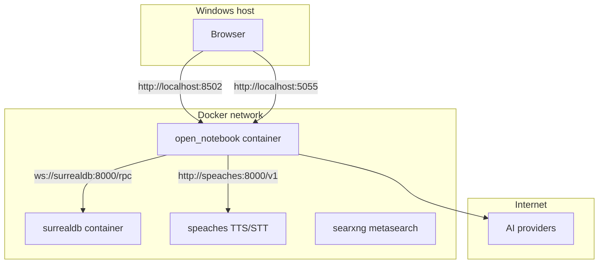
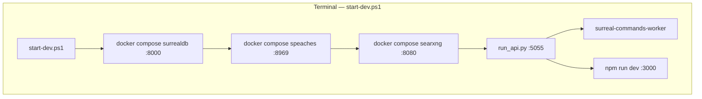

# Open Notebook — Windows 部署指南

本文档面向 **Windows 10/11**，说明推荐的 **Docker Compose** 部署与可选的 **源码本地开发** 部署，并标注平台差异与已知仓库问题。

---

## 1. 部署方式对比

| 方式 | 适用场景 | UI 入口 | 复杂度 |
|------|-----------|----------|--------|
| **A. Docker Compose（推荐）** | 快速使用、生产向自托管 | 容器映射端口（默认 **8502**） | 低 |
| **B. 源码 + 本机 Node/Python** | 二次开发、调试前端/后端 | 开发服务器 **http://localhost:3000** | 中高 |

---

## 2. 方案 A：Docker Compose（推荐）

### 2.1 前置条件

- **Docker Desktop for Windows**（建议启用 **WSL2** 后端）  
  下载：<https://www.docker.com/products/docker-desktop/>
- 至少一种 **AI 能力来源**：云端 API Key，或本机 **Ollama**（见下文可选章节）
- 可编辑文本编辑器，用于修改 `OPEN_NOTEBOOK_ENCRYPTION_KEY`

### 2.2 服务拓扑



官方根目录 [`docker-compose.yml`](../../docker-compose.yml) 要点：

- **SurrealDB**：镜像 `surrealdb/surrealdb:v2`，主机端口 **8000**，数据卷 `./surreal_data`
- **Speaches**（本地 TTS/STT）：镜像 `ghcr.io/speaches-ai/speaches:latest-cpu`，主机端口 **8969**，模型缓存卷 `hf-hub-cache`
- **SearXNG**（互联网关键词搜索，可选）：镜像 `searxng/searxng:latest`，主机端口 **8080**，配置卷 `./searxng` → 容器 `/etc/searxng`
- **应用**：镜像 `lfnovo/open_notebook:v1-latest`，端口 **8502**（Web）、**5055**（API），数据卷 `./notebook_data` → 容器 `/app/data`；依赖 `surrealdb` 与 `speaches`
- **必填环境变量**：`OPEN_NOTEBOOK_ENCRYPTION_KEY`（用于加密存储在库中的 API 凭证）

**镜像仓库备选**：Docker Hub `lfnovo/open_notebook` 与 **GHCR** `ghcr.io/lfnovo/open-notebook` 均有发布；企业网络屏蔽 Hub 时可改用 GHCR（需自行改 compose 中 image 字段）。

### 2.3 操作步骤（PowerShell）

1. 创建工作目录，将仓库中的 **`docker-compose.yml`** 复制到该目录（或按 [Docker Compose 安装](../1-INSTALLATION/docker-compose.zh.md) 从 raw URL 下载）。
2. 用编辑器将 `OPEN_NOTEBOOK_ENCRYPTION_KEY` 改为 **仅自己知道的长随机字符串**（丢失后已存凭证无法解密）。
3. 在该目录打开 PowerShell：

```powershell
docker compose up -d
docker compose ps
```

4. 等待约 15–30 秒后验证 API：

```powershell
Invoke-WebRequest -Uri http://localhost:5055/health -UseBasicParsing
```

应返回 JSON：`{"status":"healthy"}`（**`/health` 不在 `/api` 前缀下**）。

5. 浏览器打开 **http://localhost:8502**。
6. 在界面 **Settings → API Keys** 中添加供应商凭证 → **Test Connection** → **Discover Models** → **Register Models**。

### 2.3.1 可选：下载 Speaches 语音模型（播客 / 音视频转录）

根目录 compose 已包含 Speaches 容器，但**首次使用 TTS/STT 前需下载模型**（约 500MB–3GB，视模型而定）：

```powershell
# TTS（文本转语音，示例模型）
docker compose exec speaches uv tool run speaches-cli model download speaches-ai/Kokoro-82M-v1.0-ONNX

# STT（语音转文字，示例模型）
docker compose exec speaches uv tool run speaches-cli model download Systran/faster-whisper-small
```

在 Open Notebook 中配置（容器内访问 Speaches）：

1. **Settings → API Keys → Add Credential → OpenAI-Compatible**
2. TTS / STT Base URL：`http://host.docker.internal:8969/v1`
3. 注册对应模型后用于播客与音视频来源

详见 [本地 TTS](../5-CONFIGURATION/local-tts.zh.md)、[本地 STT](../5-CONFIGURATION/local-stt.zh.md)。若不需要本地语音能力，可忽略此步，仅配置云端 LLM 即可。

### 2.4 常用维护命令

```powershell
docker compose logs -f
docker compose restart
docker compose down
docker compose pull
docker compose up -d
```

**彻底清空数据**（慎用）：

```powershell
docker compose down -v
# 并删除主机目录 surreal_data、notebook_data（若需）
```

### 2.5 Windows 与卷路径说明

- Compose 中 **`./surreal_data`**、**`./notebook_data`** 相对 **当前 `docker-compose.yml` 所在目录**，会在 Windows 上正确映射为绑定挂载。
- `surrealdb` 服务中的 **`user: root`** 主要解决 **Linux** 上 bind mount 权限问题；Docker Desktop 在 Windows 上通常可直接使用官方 compose。

### 2.6 端口冲突

若 **8502**、**5055**、**8000**、**8080** 或 **8969** 已被占用，在 `docker-compose.yml` 中修改左侧主机端口，例如：

```yaml
ports:
  - "8503:8502"
  - "5056:5055"
```

### 2.7 防火墙

首次运行时若浏览器无法访问，检查 **Windows Defender 防火墙** 是否允许 **Docker Desktop** 的专用/公用网络访问。

### 2.8 WSL2 内存（可选）

大模型或 Ollama 在 WSL2 内运行时，可在用户目录 `%USERPROFILE%` 下 `.wslconfig` 中提高 `memory` 上限，避免 OOM。

---

## 3. 可选：Compose + Ollama

仓库提供示例：**[`examples/docker-compose-ollama.yml`](../../examples/docker-compose-ollama.yml)**。  
在 **Windows + Docker Desktop** 上，若 Ollama 跑在 **宿主机**，容器内访问应使用 **`http://host.docker.internal:11434`**（在 Settings 的 Ollama 凭证里配置 base URL）。详见 [Ollama 配置](../5-CONFIGURATION/ollama.zh.md)。

---

## 4. 方案 B：源码运行（开发者）

### 4.1 前置条件

- **Python 3.11+**（与 [`pyproject.toml`](../../pyproject.toml) / 文档一致）
- **Node.js 18+**
- **Git**
- **Docker Desktop**（用于启动 SurrealDB 与 Speaches，除非你有外部实例）
- **uv**（推荐）：<https://docs.astral.sh/uv/getting-started/installation/>（Windows 可用 PowerShell 安装脚本或 `pip install uv`）

### 4.2 进程结构

**推荐**：单终端运行根目录启动脚本，由脚本拉起 SurrealDB、API、后台 worker，并前台运行前端。



手动多终端方式见 [4.4](#44-手动多终端启动备选)。

### 4.3 一键启动（推荐）

仓库根目录提供 PowerShell 启动/停止脚本（已在本机验证：API `/health`、前端 3000、退出后释放 5055/3000 端口）。

**首次使用**（会执行 `uv sync`、`npm install`；若无 `.env` 则从模板创建并写入 `SURREAL_URL=ws://127.0.0.1:8000/rpc`；默认还会启动 Speaches 并**首次下载 TTS/STT 模型**，约 3GB，耗时数分钟）：

```powershell
cd D:\code\open-notebook   # 换成你的克隆路径

# 编辑加密密钥（若脚本刚生成 .env）
notepad .env

# 启动（任选一种）
.\start-dev.ps1
# 或
start-dev.bat
```

**再次启动**（跳过依赖安装）：

```powershell
.\start-dev.ps1 -SkipInstall
```

**停止**：

- 在运行 `start-dev` 的终端按 **Ctrl+C**（会停止 API、worker、前端；若本次由脚本新启动 SurrealDB / Speaches / SearXNG，也会 `docker compose stop` 对应容器）。
- 或另开终端执行：

```powershell
.\stop-dev.ps1
```

**常用参数**：

| 参数 | 作用 |
|------|------|
| `-SkipInstall` | 跳过 `uv sync` 与 `npm install` |
| `-KeepDatabase` | 退出时不停止 SurrealDB、Speaches 与 SearXNG 容器 |
| `-SkipSpeaches` | 不启动本地 Speaches（无本地 TTS/STT） |
| `-SkipSpeachesModels` | 跳过首次 Speaches 模型下载（使用时再按需下载） |
| `-SkipSearxng` | 不启动 SearXNG（无互联网关键词搜索） |

**日志**：后台 API/worker 输出在 `.dev-logs/`（已加入 `.gitignore`）。Speaches 模型下载完成标记：`.dev-logs/speaches-models.ok`（删除后可重新拉取）。

**脚本行为补充**：

- 启动 **worker** 时会自动设置 `PYTHONUTF8=1` 与 `PYTHONIOENCODING=utf-8`，避免中文 Windows 下 GBK 控制台导致 `surreal-commands` 启动崩溃（来源/播客任务无法执行）。
- 若 Docker 未运行但已安装 Docker Desktop，脚本会尝试**自动启动 Docker Desktop** 并等待就绪（最长约 3 分钟）。
- 若 **8000** / **8969** / **8080** 端口已有服务监听，脚本会复用现有实例，退出时不会停止非本次启动的容器。
- 当 `.env` 中 **`SEARXNG_ENABLED=true`** 时，脚本会启动 SearXNG（除非 `-SkipSearxng`）。修改 `.env` 后需重启 dev 服务，API 才会加载新变量。
- 使用公司 HTTP 代理时，`.env.example` 中的 **`NO_PROXY`** 建议保留，避免 localhost 健康检查与 Speaches 调用失败。

**相关文件**：

| 文件 | 说明 |
|------|------|
| [`start-dev.ps1`](../../start-dev.ps1) / [`start-dev.bat`](../../start-dev.bat) | 根目录快捷入口 |
| [`scripts/start-dev-windows.ps1`](../../scripts/start-dev-windows.ps1) | 启动逻辑 |
| [`scripts/stop-dev-windows.ps1`](../../scripts/stop-dev-windows.ps1) | 停止逻辑（端口 3000/5055 及 dev 进程） |

访问地址：

- **前端**：<http://localhost:3000>  
- **OpenAPI**：<http://localhost:5055/docs>  
- **SurrealDB**：<http://localhost:8000>（WebSocket 由应用使用）  
- **Speaches**（默认启用）：<http://localhost:8969>  
- **SearXNG**（`.env` 中 `SEARXNG_ENABLED=true` 时由脚本启动）：<http://localhost:8080>

**本地语音（Speaches）UI 配置**（Settings → API Keys → OpenAI-Compatible）：

| 项 | 值 |
|----|-----|
| Base URL | `http://127.0.0.1:8969/v1` |
| TTS 模型 | `hexgrad/Kokoro-82M-v1.1-zh`（脚本默认下载） |
| STT 模型 | `Systran/faster-whisper-large-v3`（脚本默认下载） |

也可使用云端备用（见 `.env.example` 中 SiliconFlow 注释）。安装文档亦参考：**[从源码安装](../1-INSTALLATION/from-source.zh.md)**。

**互联网关键词搜索（SearXNG，可选）** — 在 `.env` 中设置：

| 项 | 值 |
|----|-----|
| `SEARXNG_ENABLED` | `true` |
| `SEARXNG_BASE_URL` | `http://localhost:8080` |

脚本会在 API 启动前拉起 SearXNG 容器。笔记本内：**添加来源 → 关键词搜索网页**。详见 [添加来源](../3-USER-GUIDE/adding-sources.zh.md)。

### 4.4 手动多终端启动（备选）

```powershell
cd D:\code\open-notebook   # 换成你的克隆路径

# Python 依赖
uv sync

# 前端依赖
cd frontend
npm install
cd ..

# 环境变量：复制模板并编辑 OPEN_NOTEBOOK_ENCRYPTION_KEY
Copy-Item .env.example .env
# 若仅本机 Docker 中的 SurrealDB，可将 SURREAL_URL 设为：
# ws://127.0.0.1:8000/rpc
notepad .env

# 启动数据库、Speaches 与 SearXNG（在项目根目录，使用根目录 docker-compose）
docker compose up -d surrealdb speaches searxng

# 终端 2：API
uv run --env-file .env run_api.py
# 或（直接运行 uvicorn 被拦截时）
uv run --env-file .env python -m uvicorn api.main:app --host 0.0.0.0 --port 5055

# 终端 3：后台 worker（来源处理、播客等异步任务）
# 中文 Windows 需 UTF-8，否则 Rich 输出 Unicode 时 worker 会因 GBK 崩溃
$env:PYTHONUTF8 = "1"
$env:PYTHONIOENCODING = "utf-8"
uv run --env-file .env surreal-commands-worker --import-modules commands

# 终端 4：前端
cd frontend
npm run dev
```

### 4.5 Windows 特有注意

| 问题 | 建议 |
|------|------|
| **`python-magic` / libmagic** | 文档中有 `uv pip install python-magic`；Windows 上常需 **`python-magic-bin`** 或等价方案以提供 DLL：`uv pip install python-magic-bin` |
| **PowerShell 脚本执行策略** | 若 `.\start-dev.ps1` 被拦截：`Set-ExecutionPolicy RemoteSigned -Scope CurrentUser`，或使用 **`start-dev.bat`** |
| **端口占用** | 先运行 `.\stop-dev.ps1`，或运行 `netstat -ano` 配合 `findstr ":5055 :3000 :8080 :8969"` 查看 PID |
| **关键词搜索报错 disabled** | 确认 `.env` 中 `SEARXNG_ENABLED=true` 且 `SEARXNG_BASE_URL=http://localhost:8080`；SearXNG 容器在运行；**修改 .env 后重启 API** |
| **注释了 ALLOWED_DOMAINS 仍生效** | python-dotenv 要求注释为 `# `（井号+空格）。`#SEARXNG_ALLOWED_DOMAINS=…` 仍会被解析 |
| **搜索有原始条数但展示 0 条** | 检查 `SEARXNG_ALLOWED_DOMAINS` / `SEARXNG_BLOCKED_DOMAINS`；SearXNG 引擎是否 CAPTCHA/超时（`docker compose logs searxng`） |
| **HTTP 代理 / localhost 失败** | 在 `.env` 中设置 `NO_PROXY=127.0.0.1,localhost,...`（见 `.env.example`）；脚本健康检查已绕过系统代理 |
| **Speaches 首次启动慢** | 模型下载约 3GB；可用 `-SkipSpeachesModels` 跳过，或 `-SkipSpeaches` 完全禁用 |
| **来源一直「正在处理」/ `CommandStatus.NEW`** | 多为 **worker 未运行**。查看 `.dev-logs/worker.err.log`；若见 `UnicodeEncodeError: 'gbk'`，在启动 worker 前设置 `PYTHONUTF8=1` 与 `PYTHONIOENCODING=utf-8`（**`start-dev.ps1` 已自动设置**） |
| **嵌入向量失败 / UI 仍显示未嵌入** | 查看 worker 日志是否含 `batch size ... larger than 10`。在 `.env` 设置 `OPEN_NOTEBOOK_EMBEDDING_BATCH_SIZE=10` 后重启 worker |
| **长路径** | 克隆路径过深可能导致工具链问题；可在「组策略」或注册表启用长路径支持 |
| **Makefile / `make start-all`** | 根目录 [`Makefile`](../../Makefile) 使用 **`pkill`/`pgrep`/`sleep`** 等 Unix 命令；**原生 PowerShell 下 `make start-all` 往往不可用**。请用 **[4.3 一键启动](#43-一键启动推荐)**、手动多终端，或 **Git Bash / WSL** 中运行 make。 |
| **缺失的 compose 文件名** | Makefile 中 **`docker-compose.dev.yml`**、**`docker-compose.full.yml`** 在仓库根目录**可能不存在**；开发用 compose 见 **`examples/docker-compose-dev.yml`**、**`examples/docker-compose-full-local.yml`**，需自行复制或 `-f` 指定路径。 |

### 4.6 与 Docker 全镜像的端口差异

- **源码开发**：前端 **3000**，API **5055**。  
- **官方多容器镜像**：Web **8502**，API **5055**。  
根目录 `Makefile` 的 `docker-build-local` 说明里若仍出现 **3000**，以实际 **Dockerfile / supervisord** 暴露端口为准（当前 compose 为 **8502**）。

---

## 5. 关键环境变量速查

完整列表见：**[环境变量参考](../5-CONFIGURATION/environment-reference.zh.md)**。

| 变量 | 必填 | 典型值（Compose 内） | 说明 |
|------|------|----------------------|------|
| `OPEN_NOTEBOOK_ENCRYPTION_KEY` | **是** | 自建强随机串 | 凭证加密；丢失即无法解密已存 Key |
| `SURREAL_URL` | **是** | `ws://surrealdb:8000/rpc` | 应用容器内；本机开发常用 `ws://127.0.0.1:8000/rpc` |
| `SURREAL_USER` / `SURREAL_PASSWORD` | **是** | `root` / `root` | 生产务必修改 |
| `SURREAL_NAMESPACE` / `SURREAL_DATABASE` | **是** | `open_notebook` | 与迁移预设一致 |
| `OPEN_NOTEBOOK_PASSWORD` | 否 | — | 访问 API/UI 的密码保护 |
| `API_URL` | 否 | 反代后的公网 URL | 影响前端生成的链接等 |
| `CORS_ORIGINS` | 否 | 生产建议显式域名 | 默认宽松，生产需收紧 |
| `NO_PROXY` | 否 | `127.0.0.1,localhost,...` | 代理环境下访问本机 SurrealDB / Speaches / SearXNG |
| `OPEN_NOTEBOOK_EMBEDDING_BATCH_SIZE` | 否 | `10`（DashScope 等） | 每批嵌入条数，默认 50；`text-embedding-v4` 等 API 上限常为 10 |
| `SEARXNG_ENABLED` | 否 | `false` | 设为 `true` 启用笔记本「关键词搜索网页」 |
| `SEARXNG_BASE_URL` | 启用时 | `http://localhost:8080` | 本机 dev 指向 SearXNG；Compose 内应用容器用 `http://searxng:8080` |

根目录 [`CONFIGURATION.md`](../../CONFIGURATION.md) 已迁移至 **`docs/5-CONFIGURATION/`**（中文见 [配置索引](../5-CONFIGURATION/index.zh.md)）。

---

## 6. 数据持久化与备份

| 路径（相对 compose 目录） | 内容 |
|---------------------------|------|
| `./surreal_data` | SurrealDB 持久化文件 |
| `./notebook_data` | 应用数据目录（上传文件、LangGraph SQLite checkpoint 等，以镜像内 `/app/data` 为准） |
| Docker 卷 `hf-hub-cache` | Speaches 下载的 TTS/STT 模型缓存 |

定期备份上述目录与命名卷即可在灾难恢复时还原。

---

## 7. 生产与安全（全平台）

- 修改默认 **SurrealDB** 密码与 **`OPEN_NOTEBOOK_ENCRYPTION_KEY`**。  
- 设置 **`OPEN_NOTEBOOK_PASSWORD`** 与 **`CORS_ORIGINS`**。  
- 使用反向代理与 HTTPS：见 **[反向代理](../5-CONFIGURATION/reverse-proxy.zh.md)**、**[安全](../5-CONFIGURATION/security.zh.md)**。

---

## 8. 延伸阅读

- [Docker Compose 安装](../1-INSTALLATION/docker-compose.zh.md)  
- [本地 TTS](../5-CONFIGURATION/local-tts.zh.md) / [本地 STT](../5-CONFIGURATION/local-stt.zh.md)  
- [环境变量参考](../5-CONFIGURATION/environment-reference.zh.md)（含 SearXNG）  
- [添加来源（关键词搜索）](../3-USER-GUIDE/adding-sources.zh.md)  
- [架构说明](../../spec/architecture.md)  
- [业务流程](../../spec/business-flows.md)

---

*文档随仓库演进可能过时；部署前请对照当前 `docker-compose.yml` 与 `docs_zh/`。*
