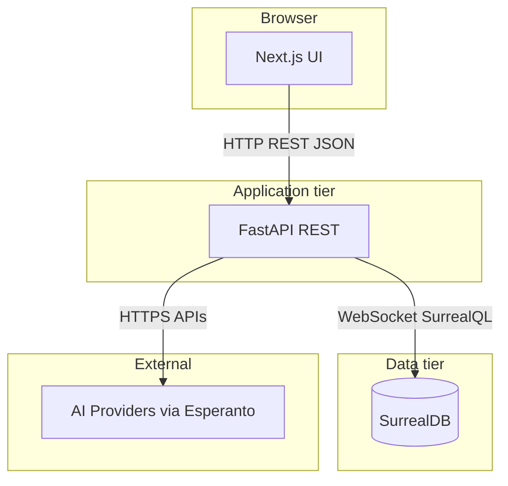
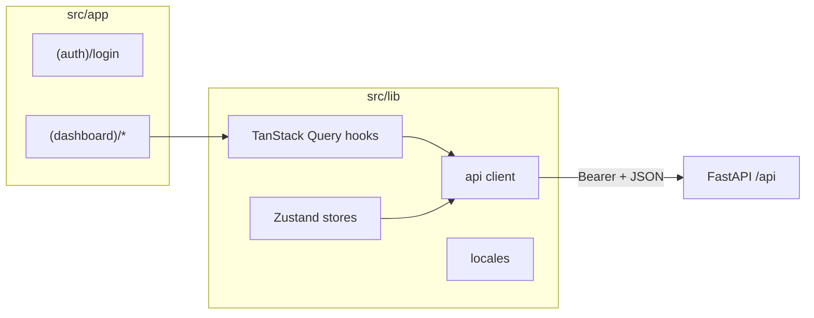
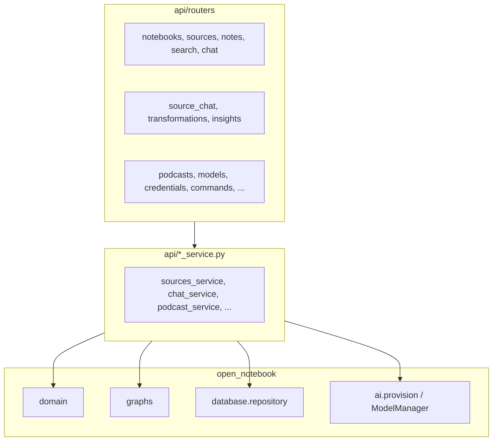
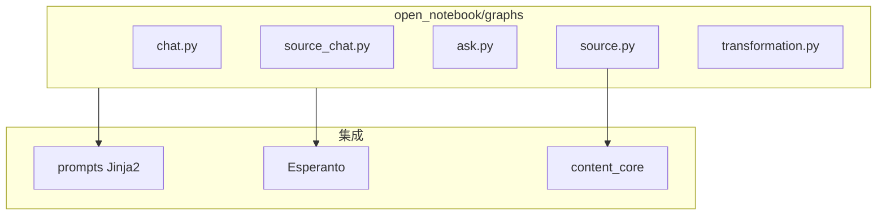
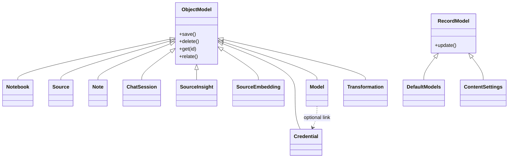
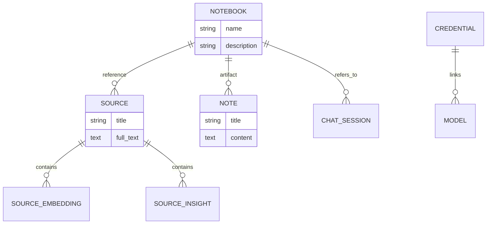
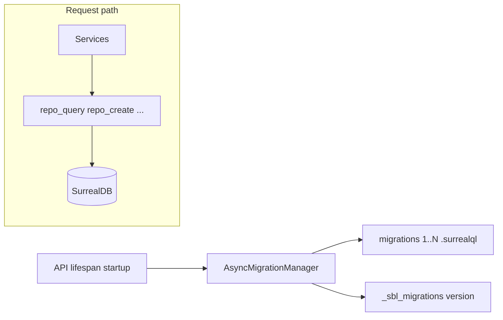

# Open Notebook — 代码架构

本文档基于仓库当前结构梳理 **Open Notebook** 的技术架构，配套 Mermaid 图表便于阅读。

---

## 1. 三层架构总览

产品定位为隐私优先、可自托管的 AI 研究助手：多模态资料入库、语义检索、对话、笔记与播客等能力。



| 层级 | 路径 / 端口 | 职责 |
|------|----------------|------|
| 前端 | `frontend/`，开发默认 **:3000**；Docker 镜像内 UI 通常为 **:8502** | App Router、组件、状态、调用 API |
| API | `api/`，默认 **:5055** | 路由、服务编排、Pydantic 校验、LangGraph 调用 |
| 数据库 | SurrealDB，Compose 中 **:8000** | 图数据、向量、凭证密文、异步任务元数据 |

**说明**：根目录 `CLAUDE.md` 中「前端 :3000」对应 **源码开发**；官方 `docker-compose.yml` 将预构建镜像映射为 **8502（Web）+ 5055（API）**。

---

## 2. 仓库目录结构

```text
open-notebook/
├── api/                    # FastAPI：routers、*_service.py、models.py、main.py
├── open_notebook/          # 核心 Python 包
│   ├── domain/             # Notebook、Source、Note、Credential 等模型
│   ├── database/         # repository、async_migrate、migrations/*.surrealql
│   ├── graphs/           # LangGraph：chat、ask、source、source_chat、transformation
│   ├── ai/                 # ModelManager、provision、key_provider、connection_tester
│   ├── podcasts/         # 播客相关领域逻辑
│   └── utils/            # 分块、加密、错误分类等
├── frontend/             # Next.js 16 + React 19 + TypeScript
├── commands/             # surreal_commands 侧 worker 逻辑（如 embedding）
├── prompts/              # Jinja2 提示模板
├── tests/                # Pytest
├── docs/                 # 用户与运维文档
├── examples/             # 各类 docker-compose 示例
└── docker-compose.yml    # 默认双容器：SurrealDB + 应用镜像
```

**迁移文件位置**：SurrealDB schema 位于 [`open_notebook/database/migrations/`](../open_notebook/database/migrations/)（`1.surrealql` … 及对应的 `*_down.surrealql`），由 `AsyncMigrationManager` 在 API 启动时执行，**不在**仓库根目录的 `migrations/`。

---

## 3. 前端架构（Next.js App Router）

前端架构说明见 [`frontend/src/CLAUDE.md`](../frontend/src/CLAUDE.md)（根目录下无 `frontend/CLAUDE.md`）。



**主要路由（`frontend/src/app/`）**

| 路由 | 说明 |
|------|------|
| `/` | 重定向到 `/notebooks` |
| `/login` | `(auth)/login` |
| `/notebooks`, `/notebooks/[id]` | 笔记本列表与详情（资料、笔记、对话等） |
| `/sources`, `/sources/[id]` | 资料列表与详情 |
| `/search` | 搜索与 Ask |
| `/transformations` | 转换模板与执行 |
| `/podcasts` | 播客 |
| `/settings`, `/settings/api-keys` | 设置与凭证 |
| `/advanced` | 高级功能 |

**技术栈**：Tailwind CSS、shadcn/ui、Zustand、TanStack Query、Axios（`lib/api/client.ts`）、i18n 多语言。

---

## 4. API 层结构



- **路由**：`api/routers/*.py`（如 `chat.py`、`sources.py`、`credentials.py`）。
- **服务**：与路由对应的 `*_service.py`，承载业务编排。
- **模型**：`api/models.py` 中 Pydantic 请求/响应体。

在 [`api/main.py`](../api/main.py) 中，绝大多数业务路由挂载在 **`/api`** 前缀下；**`/health`** 与 **`/docs`** 位于根路径（不参与 `/api` 前缀）。

---

## 5. 后端核心模块与 LangGraph



| 图模块 | 作用 |
|--------|------|
| `source.py` | 内容处理流水线：提取 → 保存 → 可选并行转换与 insight |
| `chat.py` | 笔记本上下文对话；SQLite checkpoint |
| `source_chat.py` | 单条资料对话 + ContextBuilder |
| `ask.py` | 多检索策略 + 向量检索 + 汇总答案 |
| `transformation.py` | 单节点转换子图，供 API 与 source 流水线复用 |

---

## 6. 领域模型与基类（概念）



**要点**（详见 [`open_notebook/domain/CLAUDE.md`](../open_notebook/domain/CLAUDE.md)）：

- **`ObjectModel`**：可变业务实体，多态 `get(id)` 按表前缀解析子类。
- **`RecordModel`**：单例式配置（如 `DefaultModels`、`ContentSettings`）。
- **`Source.vectorize()`**、**`Note.save()`** 等会提交 **surreal_commands** 异步任务（fire-and-forget），不阻塞 HTTP。

---

## 7. 数据存储与关系（概念 ER）

SurrealDB 中实际表名与关系以 migration 为准；下图抽象核心关联。



---

## 8. AI 与凭证链路


- **凭证**：`Credential` 使用 Fernet 加密写入库；需配置 **`OPEN_NOTEBOOK_ENCRYPTION_KEY`**。
- **`ModelManager`**：按 `Model` / `DefaultModels` 解析默认与覆盖模型；可关联凭证或回退环境变量（`key_provider`）。
- **`provision_langchain_model()`**：供 LangGraph 节点使用，含大上下文等回退策略。

---

## 9. 数据库访问与迁移



- **`open_notebook/database/repository.py`**：`db_connection` 上下文、`repo_query` / `repo_create` / `repo_upsert` 等。
- **版本管理**：`async_migrate.py` 中管理器加载编号迁移；新增迁移需同时更新管理器中的文件列表（见 [`open_notebook/database/CLAUDE.md`](../open_notebook/database/CLAUDE.md)）。

---

## 10. 错误处理

- 图节点与流式接口使用 **`classify_error()`**（`open_notebook/utils/error_classifier.py`）将供应商原始异常映射为 **`OpenNotebookError`** 子类。
- **`api/main.py`** 注册全局异常处理器，映射到 **401 / 400 / 422 / 429 / 502** 等。
- 前端 **`getApiErrorMessage()`** 优先 i18n，其次展示后端可读消息。

---

## 11. 参考文档索引

| 文档 | 内容 |
|------|------|
| [CLAUDE.md](../CLAUDE.md) | 项目总览与注意事项 |
| [api/CLAUDE.md](../api/CLAUDE.md) | API 分层、路由列表、凭证 API |
| [open_notebook/domain/CLAUDE.md](../open_notebook/domain/CLAUDE.md) | 领域模型与搜索 |
| [open_notebook/graphs/CLAUDE.md](../open_notebook/graphs/CLAUDE.md) | LangGraph 行为与坑 |
| [open_notebook/ai/CLAUDE.md](../open_notebook/ai/CLAUDE.md) | ModelManager 与 provisioning |
| [open_notebook/database/CLAUDE.md](../open_notebook/database/CLAUDE.md) | Repository 与迁移 |
| [frontend/src/CLAUDE.md](../frontend/src/CLAUDE.md) | 前端分层与数据流 |
| [docs/7-DEVELOPMENT/architecture.md](../docs/7-DEVELOPMENT/architecture.md) | 官方开发架构说明 |

---

*文档生成自仓库分析，端口与路径以实际 `docker-compose.yml` 与 `api/main.py` 为准。*
