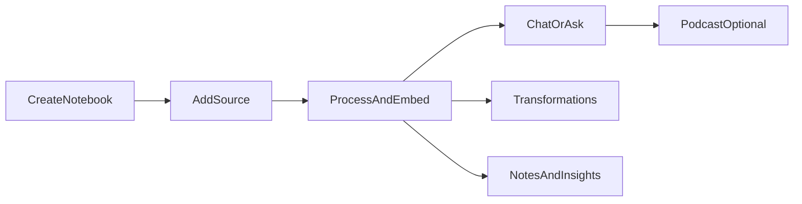
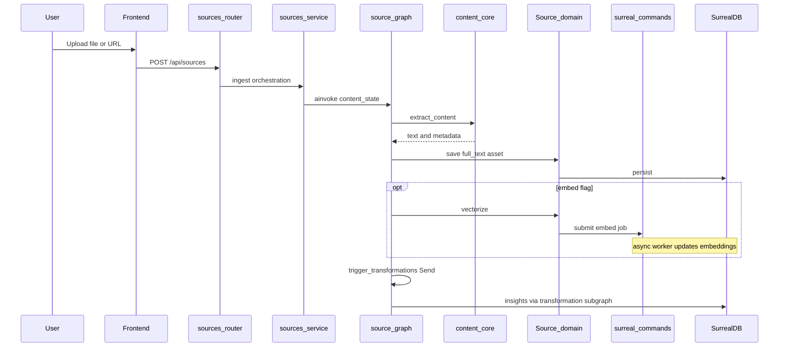
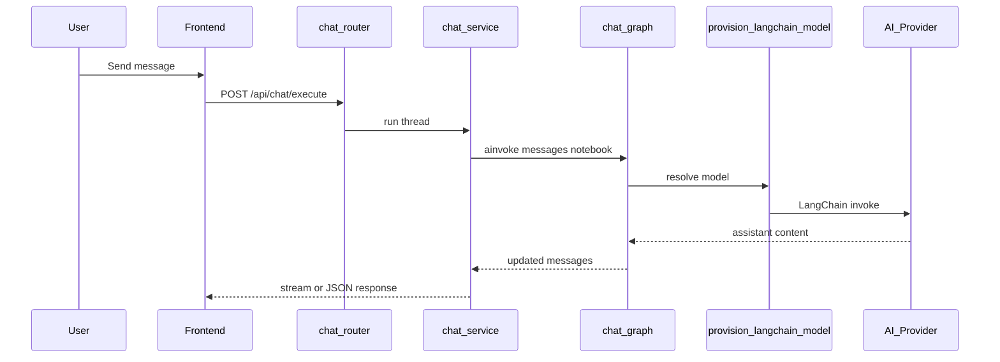
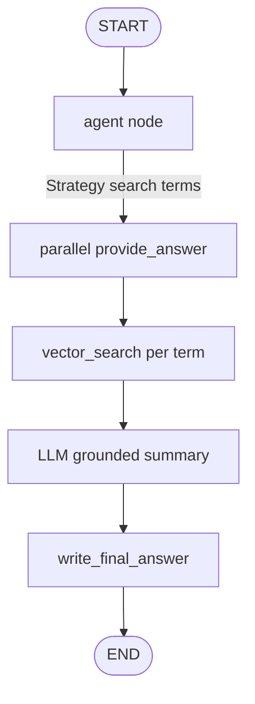
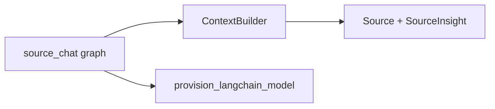
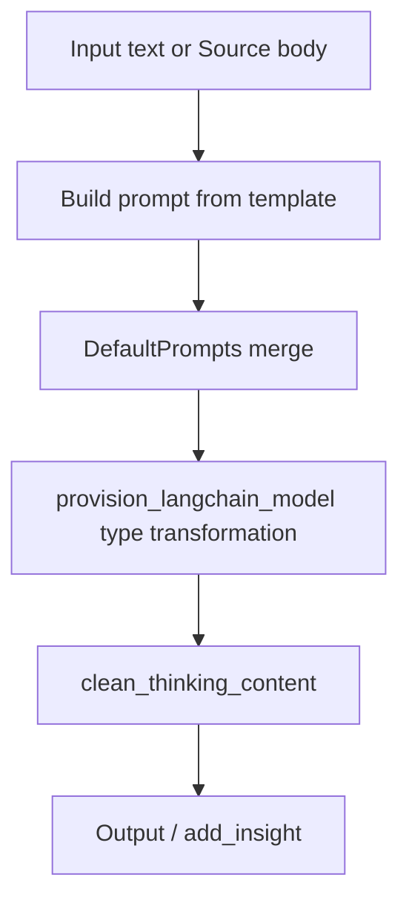
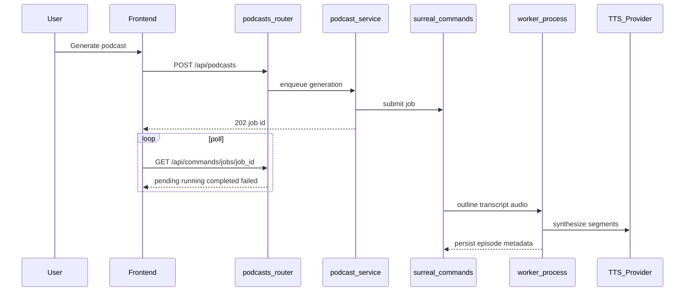
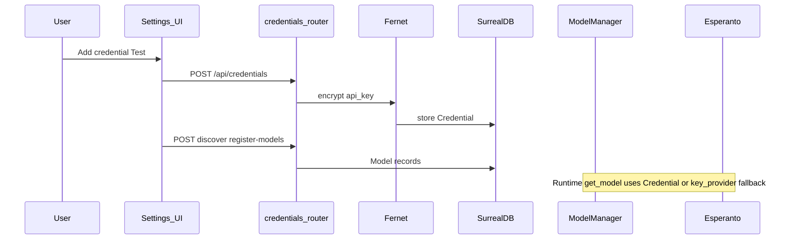
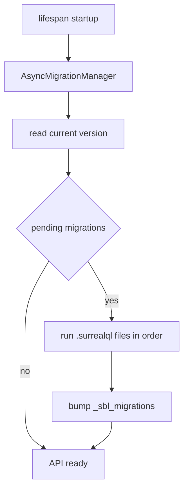
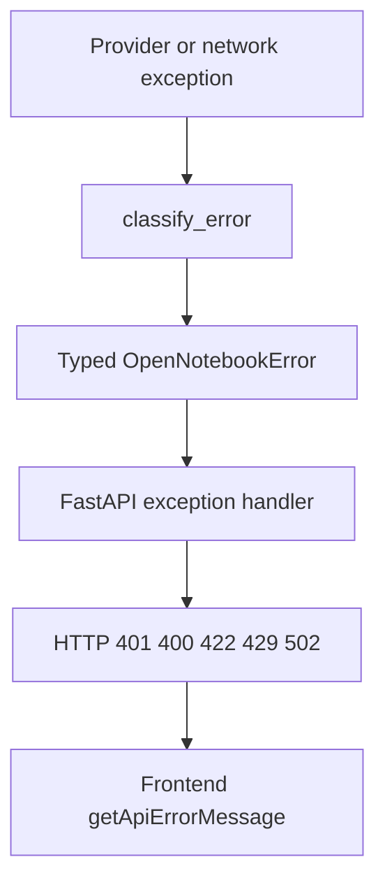

# Open Notebook — 业务流程

本文档描述主要用户旅程与后端工作流，图表使用 Mermaid。实现细节以 `api/*_service.py` 与 `open_notebook/graphs/*.py` 为准。

---

## 1. 核心用户旅程

- **笔记本**：研究容器，关联资料、笔记、会话。
- **资料（Source）**：文件或 URL，经内容提取与可选向量化后参与检索与对话。
- **对话 / Ask**：基于资料与向量检索的问答。
- **转换（Transformation）**：对正文应用模板化 LLM 流程，可产生 insight。
- **播客**：异步任务链（大纲 → 脚本 → TTS）。

---

## 2. 资料摄入（Source pipeline）

对应 **`open_notebook/graphs/source.py`**：提取 → 保存 →（可选）并行转换。

**要点**：

- **`content_core`** 负责多格式抽取；空内容（如无字幕视频）会明确失败提示。
- **`vectorize()`** 为 **fire-and-forget**，返回 command id，不阻塞 HTTP。
- 转换节点对每个 **`Transformation`** 调用子图 **`transformation.graph`**，并可 **`add_insight`**。

---

## 3. 笔记本对话（Chat）

对应 **`open_notebook/graphs/chat.py`** + **`chat_service`**；线程状态由 **LangGraph SqliteSaver** 持久化（路径受 **`LANGGRAPH_CHECKPOINT_FILE`** 等环境变量影响）。

**要点**：系统提示来自 **`prompts/`** 下 Jinja 模板（如 `chat/system`）；节点内对异常调用 **`classify_error()`**。

---

## 4. Ask（检索 + 综合）

对应 **`open_notebook/graphs/ask.py`**：代理生成检索策略 → 多路 **`vector_search`** → 各路答案 → 最终汇总。

**要点**：

- 可配置 **`strategy_model` / `answer_model` / `final_answer_model`**（RunnableConfig）。
- 当前实现以 **向量检索** 为主路径（与 `graphs/CLAUDE.md` 描述一致）。

API 侧典型入口：**`POST /api/search/ask`**（及简化变体，见 `search` router）。

---

## 5. 单资料对话（Source chat）

对应 **`open_notebook/graphs/source_chat.py`**：**ContextBuilder** 注入资料与 insights，同样使用 **SQLite checkpoint** 维护会话。

---

## 6. 转换（Transformation）

独立子图 **`transformation.py`**：输入文本或 **`Source.full_text`** + **`Transformation`** 模板 → LLM → 输出；可选写回 insight。

API：**`POST /api/transformations/execute`** 等（见 `transformations` router）。

---

## 7. 搜索（文本 + 向量）

领域函数在 **`open_notebook/domain/notebook.py`**：**`text_search`**、**`vector_search`**（默认有最小分数阈值）。Ask 工作流主要消费 **向量检索**。

---

## 8. 播客生成（异步）

**`podcast_service`** 通过 **surreal_commands** 提交长时间任务；HTTP 快速返回，客户端轮询任务状态。

**说明**：具体路径以 **`api/routers/commands.py`** 为准（当前为 **`/api/commands/jobs/{job_id}`** 等）。

---

## 9. 凭证与模型注册

---

## 10. 数据库迁移（启动时）

迁移文件目录：**[`open_notebook/database/migrations/`](../open_notebook/database/migrations/)**。

---

## 11. 错误处理链路

---

## 12. API 与页面对照（速查）

| 业务能力 | 典型 API 前缀（均在 `/api` 下） | 前端区域 |
|----------|-------------------------------|----------|
| 笔记本 CRUD | `/api/notebooks` | `/notebooks` |
| 资料 | `/api/sources` | `/sources`, 笔记本内嵌 |
| 笔记 | `/api/notes` | 笔记本详情 |
| 搜索 / Ask | `/api/search`, `/api/search/ask` | `/search` |
| 对话会话 | `/api/chat/...` | 笔记本详情 |
| 资料对话 | `/api/sources/{id}/chat/...` | 资料详情 |
| 转换 | `/api/transformations` | `/transformations` |
| 播客 | `/api/podcasts` | `/podcasts` |
| 模型与默认 | `/api/models` | `/settings` |
| 凭证 | `/api/credentials` | `/settings/api-keys` |
| 异步任务 | `/api/commands/jobs/...` | 各功能轮询状态 |

---

*若行为与代码不一致，以运行时 `api/routers` 与图实现为准。*
